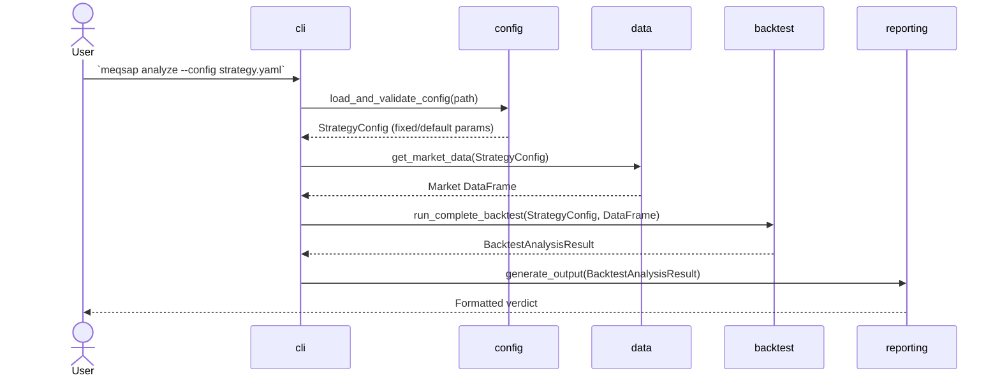
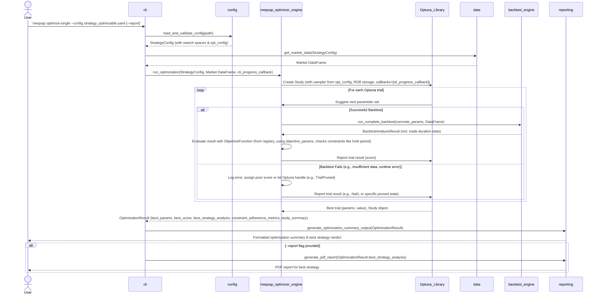

# MEQSAP Architecture Document - v2.3 (Revised)

**Document Version:** v2.3, Updated June 5, 2025, based on review feedback.
**Previous Version:** v2.3 (Initial)

## Technical Summary

This document outlines the architecture for the Minimum Viable Quantitative Strategy Analysis Pipeline (MEQSAP). The system is designed as a command-line tool that orchestrates a suite of powerful, existing Python libraries to provide an end-to-end backtesting and analysis workflow. It takes a simple YAML configuration file as input, runs a backtest, performs a series of validation and robustness checks, and presents a clear verdict in the terminal.

**Version 2.2 Foundation:** This version incorporated the **Enhanced Indicator & Parameter Definition Framework** (`meqsap_indicators_core`) and introduced the **Phase 2: Parameter Optimization Engine (Single Indicator)** as defined in PRD v2.2.
**Version 2.3 Revisions (Current - Revised):** This version incorporates review feedback to further refine the v2.3 architecture, ensuring closer alignment with PRD v2.2 requirements and enhancing clarity for future development. Key architectural updates include:
*   Explicit definition of the **objective function registry** and **`ObjectiveFunction` protocol** within `meqsap_optimizer.objectives`.
*   Detailed specification of **optimization progress reporting** mechanisms (Optuna callbacks integrated with `rich` progress bars).
*   Clear methodology for calculating **constraint adherence metrics**, particularly `pct_trades_in_target_hold_period`.
*   Enhanced **error handling strategies** within the optimization loop, reflected in sequence diagrams.
*   Clarified integration of **PDF reporting for optimized strategies**.
*   Introduction of **extension points** and explicit **roadmap alignment** to better prepare for future phases (Phases 3-10).
*   Recommendation for **Optuna's RDB storage** for trial history logging and future persistence.
*   Proposal for a **`TradeConstraint` protocol** for more formal and extensible constraint handling.

The primary goal remains to validate a high-level orchestration approach, prioritizing rapid development and reliability by leveraging battle-tested components to solve the immediate requirements for automated parameter tuning.

## High-Level Overview

The MEQSAP application is built as a **Modular Monolith** contained within a **single repository**. This approach simplifies development, dependency management, and deployment for a command-line tool.

The primary data flows are:

1.  **Analysis Path (existing):**
    *   User invokes `meqsap analyze`, providing a strategy `.yaml` file (with fixed or default parameters).
    *   Configuration is loaded and validated via `config` module.
    *   Market data is acquired via `data` module (using `yfinance` and caching).
    *   Backtest is run by `backtest` module (using `vectorbt` and indicator logic from `meqsap_indicators_core`).
    *   Results are presented by `reporting` module.

2.  **Optimization Path (New for v2.2/2.3 - Refined):**
    *   User invokes `meqsap optimize-single`, providing a strategy `.yaml` file that includes parameter search spaces and an `optimization_config` block.
    *   Configuration is loaded and validated by `config` module.
    *   The `meqsap_optimizer` module (using `Optuna`) takes over:
        *   It uses the defined parameter search spaces and the `optimization_config`.
        *   It iteratively generates parameter sets using the chosen algorithm (e.g., Grid Search via `Optuna`'s grid sampler). **Progress is reported to the user via `rich` progress bars, driven by Optuna callbacks managed by the `cli` module.**
        *   For each parameter set (Optuna trial), it invokes `run_complete_backtest` (from `meqsap.backtest`) to get performance and trade duration statistics. It **handles individual backtest failures gracefully** (e.g., by logging the error and allowing Optuna to prune the trial or assign a poor score).
        *   It evaluates these results against the specified objective function (selected from a registry), which incorporates constraint handling.
        *   It identifies and reports the best parameter set found. **Trial history can be logged using Optuna's RDB storage for persistence and later analysis.**
    *   Results, including the best parameters, their performance, and constraint adherence, are presented by the `reporting` module. If the `--report` flag is used, a PDF report for the *best found strategy* is generated.

```mermaid
graph TD
    subgraph "User Interaction"
        A[Strategist] --invokes `analyze`--> B{MEQSAP CLI};
        A --invokes `optimize-single [--report]`--> B;
    end

    subgraph "MEQSAP Core - Analysis Path"
        B --.yaml (fixed/default params)--> C[1. Load & Validate Config (config.py)];
        C --uses--> MIC((meqsap_indicators_core));
        C --uses--> D[Pydantic Schema];
        C --on success--> E[2. Acquire Data (data.py)];
        E --checks--> F[(File Cache)];
        F --on miss--> G(yfinance API);
        G --stores--> F;
        F --provides data--> H[3. Run Backtest (backtest.py)];
        E --provides data--> H;
        H --uses vectorbt & indicator logic from--> MIC;
        H --generates--> I[Signals & Stats];
        I --results--> J[4. Present Verdict & Report (reporting.py)];
    end
    
    subgraph "MEQSAP Core - Optimization Path (v2.3 Revised)"
        B --.yaml (param spaces & opt_config)--> C;
        C --Validated Config & Opt Config--> Optimizer[meqsap_optimizer (uses Optuna)];
        Optimizer --uses param spaces from (Config -> IndicatorsCore)--> MIC;
        Optimizer --iteratively calls (with progress reporting via CLI & error handling)--> H;
        H --BacktestAnalysisResult (incl. trade duration)--> Optimizer;
        Optimizer --evaluates with ObjectiveFunction (from registry, incl. constraint checks)--> Optimizer;
        Optimizer --Best Params & Results (Optuna Study for history)--> J;
    end

    subgraph "Output"
        J --uses rich, pyfolio--> K[Formatted Terminal Verdict/Optimization Summary (incl. progress, constraint adherence)];
        J --if --report with optimize-single--> PDFReport((PDF Report for Best Optimized Strategy));
    end
```

## Architectural / Design Patterns Adopted

The following high-level patterns guide the system's design:

*   **Pattern 1: Modular Monolith:** A single deployable unit, ideal for a CLI tool. Structured into distinct modules (`config`, `data`, `backtest`, `reporting`, `indicators_core`, and new `optimizer`) with clear boundaries.
*   **Pattern 2: Orchestration & Facade:** MEQSAP acts as a simplifying facade to underlying libraries (`vectorbt`, `pyfolio`, `Optuna`, etc.) and internal modules.
*   **Pattern 3: Declarative Configuration:** Users declare strategy parameters and optimization settings in `.yaml`. The application interprets this, separating definition from logic.
*   **Pattern 4: Schema-Driven Validation:** Pydantic defines strict schemas for YAML, ensuring input integrity and clear error feedback.
*   **Pattern 5: Caching:** File-based caching for market data improves performance.
*   **Pattern 6: Library-based Componentization:** `meqsap_indicators_core` and `meqsap_optimizer` are dedicated internal modules promoting high cohesion and loose coupling.
*   **Pattern 7: Strategy Pattern (within Optimizer):** The `meqsap_optimizer` can use different optimization algorithms (via `Optuna` samplers) and objective functions (via a registry and `ObjectiveFunction` protocol) interchangeably, supporting future expansion. This pattern can also be applied to `TradeConstraint` implementations.

## Component View

The MEQSAP application comprises the following primary modules:

*   **`config` Module:** Loads strategy `.yaml` files. Utilizes `meqsap_indicators_core` for indicator parameter definitions. Parses and validates the `optimization_config` block and parameter space definitions against Pydantic models.
*   **`data` Module:** Handles market data acquisition (`yfinance`), caching, and integrity checks.
*   **`meqsap_indicators_core` Module:** Standardizes definition, parameterization (fixed, range, choice), validation, and calculation logic for technical indicators.
*   **`backtest` Module:** Core backtesting engine.
    *   `StrategySignalGenerator` uses `meqsap_indicators_core` for indicator logic.
        *   *Future Extension Point (Phase 5):* This module will integrate with a `meqsap_signal_combiner` for rule-based signal generation.
    *   Executes backtests using `vectorbt`.
    *   `run_complete_backtest` populates `BacktestResult` with **mandatory** trade duration statistics. Trade durations are calculated from `vectorbt`'s `trades.records_readable`.
        *   *Future Extension Point (Phase 7):* The `run_complete_backtest` signature will be extended to accept an optional `regime_data: Optional[pd.Series] = None` parameter.
*   **`meqsap_optimizer` Module (New for v2.2, Simplified in v2.3, Refined):** Responsible for automated parameter optimization.
    *   **Engine (`engine.py`):** Orchestrates the optimization loop (using Optuna).
        *   Provides a simple callback mechanism (`progress_callback`) for the `cli` module to hook into for progress updates. This decouples the optimizer from any specific UI library like `rich`.
        *   Handles individual backtest failures within a trial gracefully (e.g., logs error, Optuna prunes or assigns a bad score).
        *   Supports Optuna's RDB storage (e.g., SQLite) for persisting trial history, enabling future resumption or detailed analysis of optimization runs.
    *   **Algorithms:** Implements Grid Search, Random Search by using the appropriate `Optuna` samplers.
    *   **Objective Functions (`objectives.py`):**
        *   Defines an `ObjectiveFunction` protocol (as per PRD Epic4 Story2 AC1):
            ```python
            from typing import Protocol, Any
            # from meqsap.backtest import BacktestAnalysisResult # Or a more specific result type

            class ObjectiveFunction(Protocol):
                def __call__(self, result: Any, # BacktestAnalysisResult or similar
                             objective_params: dict[str, Any]) -> float:
                    ...
            ```
        *   Implements a registry (e.g., a dictionary `OBJECTIVE_FUNCTION_REGISTRY`) mapping YAML names to `ObjectiveFunction` implementations (PRD Epic4 Story2 AC4).
        *   Includes the explicit **"SharpeWithHoldPeriodConstraint"** function, which uses trade duration statistics from `BacktestResult` to apply penalties to the objective score if constraints are not met.
        *   *Future Extension Point:* Will incorporate a `TradeConstraint` protocol for composable and extensible constraint handling.
    *   **Data Models (`models.py`):** Contains Pydantic models for the `optimization_config` block and the `OptimizationResult`.
*   **`reporting` Module:** Presents results. For analysis, shows standard backtest verdict. For optimization, shows a summary (best params, score, etc.) and detailed verdict for the best strategy. Optimization summary **explicitly includes constraint adherence metrics**, particularly hold period statistics (PRD Epic4/Story6/AC4).
    *   If the `--report` flag is used with `optimize-single`, it generates a PDF report for the *best found strategy* using `pyfolio`.
*   **`cli` Module:** Main entry point package. Parses arguments and orchestrates workflows.
    *   `__init__.py`: Main `analyze` command and pipeline orchestration.
    *   `commands/`: Contains sub-commands like `optimize`.
    *   `utils.py`: Contains shared utilities like the error handling decorator.
    *   `optimization_ui.py`: Manages `rich` progress bars and UI for optimization, driven by callbacks from the `meqsap_optimizer.engine`.

```mermaid
graph TD
    subgraph "Entrypoint"
        CLI
    end

    subgraph "Core Logic & Libraries"
        ConfigModule[config]
        IndicatorsCore[meqsap_indicators_core]
        DataModule[data]
        BacktestModule[backtest]
        OptimizerModule[meqsap_optimizer (uses Optuna)]
        ReportingModule[reporting]
    end

    subgraph "External Libraries"
        Pydantic
        PyYAML
        yfinance
        Optuna
        PandasTA["pandas-ta (via IndicatorsCore)"]
        vectorbt
        rich
        pyfolio
    end

    CLI -- "analyze" / "optimize-single [--report]" --> ConfigModule
    ConfigModule --uses--> Pydantic
    ConfigModule --uses for indicator defs & validation--> IndicatorsCore
    ConfigModule --Validated Config--> DataModule
    ConfigModule --Validated Config & Opt.Settings--> OptimizerModule

    DataModule --uses--> yfinance
    DataModule --Market Data--> BacktestModule
    
    OptimizerModule --uses param spaces from (Config -> IndicatorsCore)--> IndicatorsCore
    OptimizerModule --runs backtests for param sets via (with progress updates to CLI & error handling)--> BacktestModule
    OptimizerModule --Optuna Study (RDB for history)--> Optuna
    BacktestModule --BacktestAnalysisResult (incl. trade duration)--> OptimizerModule
    OptimizerModule --Best params & results--> ReportingModule

    BacktestModule --uses for indicator logic & calculation--> IndicatorsCore
    IndicatorsCore --may wrap--> PandasTA
    BacktestModule --uses--> vectorbt
    BacktestModule --Raw Results (for analyze path)--> ReportingModule
    
    ReportingModule --uses--> rich
    ReportingModule --uses--> pyfolio
    ReportingModule --> TerminalOutput[Terminal Verdict / Opt. Summary]
    ReportingModule --if --report with optimize-single--> PDFReport((PDF Report for Best Strategy))
```

## Project Structure

The project uses a standard `src` layout.

```plaintext
meqsap/
├── docs/
│   ├── adr/                    # Architectural Decision Records
│   ├── policies/               # Development policies and guidelines
│   ├── architecture.md         # This document
│   ├── prd.md                  # Product Requirements Document
│   └── ...
├── examples/
│   └── ...
├── src/
│   └── meqsap/
│       ├── __init__.py
│       ├── backtest.py           # Core backtesting, StrategySignalGenerator, BacktestResult enhanced
│       │                         # Future: regime_data param, SignalCombiner hook
│       ├── cli/                  # Main CLI package
│       │   ├── __init__.py       # Main CLI entrypoint, command orchestration
│       │   ├── commands/         # Command implementations (e.g., optimize)
│       │   ├── optimization_ui.py # UI components for optimization
│       │   └── utils.py          # CLI utilities (e.g., error handlers)
│       ├── config.py             # Pydantic schema, YAML loading
│       ├── data.py               # Data acquisition and caching
│       ├── exceptions.py         # Custom application exceptions
│       ├── reporting.py          # Terminal output and PDF generation
│       ├── indicators_core/      # Indicator definitions and logic
│       │   └── ...
│       ├── optimizer/            # NEW: meqsap_optimizer module
│       │   ├── __init__.py
│       │   ├── engine.py         # Core optimization engine (using Optuna, callbacks, RDB storage)
│       │   ├── models.py         # Pydantic models for optimizer (config, results)
│       │   └── objectives.py     # ObjectiveFunction protocol, registry, implementations
│       │                         # Future: TradeConstraint protocol
│       └── py.typed
├── tests/
│   ├── optimizer/              # NEW: Tests for the simplified optimizer module
│   │   ├── __init__.py
│   │   ├── test_engine.py
│   │   └── test_objectives.py
│   └── ...
├── .gitignore
├── pyproject.toml
├── README.md
└── requirements.txt
```

## Definitive Tech Stack Selections

| Category                 | Technology                | Version / Details         | Justification                                                                                                |
| :----------------------- | :------------------------ | :------------------------ | :----------------------------------------------------------------------------------------------------------- |
| **Languages** | Python                    | 3.9+                      | Specified.                                                                                                   |
| **CLI Framework** | Typer                     | Latest                    | Integrates well with Pydantic for robust CLI building.                                                       |
| **Data Handling** | pandas                    | Latest                    | Industry standard for core data manipulation.                                                                |
|                          | yfinance                  | Latest                    | Meets requirements for historical OHLCV data.                                                                |
| **Technical Analysis** | pandas-ta                 | Latest                    | Comprehensive TA library, wrapped by `meqsap_indicators_core`.                                               |
| **Backtesting** | vectorbt                  | Latest                    | Powerful and modern vectorized backtesting engine.                                                           |
| **Configuration** | PyYAML, Pydantic          | Latest                    | Standard and secure YAML loading combined with strict schema validation for data integrity.                  |
| **Reporting & UI** | rich                      | Latest                    | Provides polished CLI UX and progress indicators.                                                            |
|                          | pyfolio                   | Latest                    | Industry standard for generating PDF tear sheets.                                                            |
| **Internal Components** | `meqsap_indicators_core`  | N/A (Internal)            | Ensures modularity, maintainability, and readiness for optimization.                                         |
|                          | `meqsap_optimizer`        | N/A (Internal)            | Implements Phase 2 (PRD v2.2) for automated parameter tuning.                                                |
| **Optimization** | Optuna                    | Latest                    | A powerful, standard framework for hyperparameter optimization. Its trial, sampler, callback, and storage (RDB) abstractions simplify implementation and provide a clear path to advanced features. |
| **Testing** | pytest                    | Latest                    | De facto standard for unit and integration testing.                                                          |
| **CI/CD** | GitHub Actions            | N/A                       | Well-integrated for automation.                                                                              |

## API Reference

### External APIs Consumed
*   **`yfinance` API**: For historical market data.
*   **`Optuna` API**: For defining studies, trials, samplers, callbacks, and storage backends within `meqsap_optimizer`.

### Internal APIs Provided
Not applicable. MEQSAP is a self-contained command-line tool.

## Data Models

*   **`StrategyConfig`** (`meqsap.config`): Represents the complete configuration from YAML, including `ticker`, `start_date`, `end_date`, `strategy_params` (which can be fixed values or parameter space definitions), and an optional `optimization_config` block.
*   **`OptimizationConfig`** (`meqsap.optimizer.models`): A Pydantic model defining the optimization `algorithm`, `objective_function`, and their respective parameters (e.g., `objective_params` like `min_hold_days`, `max_hold_days`).
*   **Indicator & Parameter Definitions** (`meqsap_indicators_core`): `IndicatorBase`, `ParameterDefinition`, `ParameterSpace`, etc., are foundational for the optimizer.
*   **`BacktestResult`** (`meqsap.backtest`): Holds detailed performance metrics. **Enhanced for v2.2/2.3 (Mandatory Fields):**
    *   `avg_trade_duration_days: float`
    *   `pct_trades_in_target_hold_period: float`
    *   **Calculation Methodology for `pct_trades_in_target_hold_period`**:
        `(Number of trades where objective_params['min_hold_days'] <= trade_duration_days <= objective_params['max_hold_days']) / (Total number of trades) * 100`.
        Trade durations are derived from `vectorbt`'s `trades.records_readable` using `(trades.exit_timestamp - trades.entry_timestamp).dt.days`.
    *   *Future Extension Point (Phase 8):* `diagnostic_report: Optional[DiagnosticReport] = None` (where `DiagnosticReport` would be a Pydantic model defined by `meqsap_strategy_doctor`).
*   **`OptimizationResult`** (`meqsap_optimizer.models`): A Pydantic model holding results from an optimization run, including `best_params`, `best_score`, the full analysis for the best strategy, and a summary of constraint adherence.
*   **`ObjectiveFunction` Protocol** (`meqsap.optimizer.objectives`): Defines the interface for objective functions.
*   **`TradeConstraint` Protocol** (Conceptual, for future implementation in `meqsap.optimizer.objectives` or `constraints.py`):
    ```python
    from typing import Protocol, Any
    # from meqsap.backtest import BacktestAnalysisResult 

    class TradeConstraint(Protocol):
        def is_met(self, result: Any, # BacktestAnalysisResult or trade list
                   constraint_params: dict[str, Any]) -> bool:
            ...
        def calculate_penalty(self, result: Any, # BacktestAnalysisResult or trade list
                              constraint_params: dict[str, Any]) -> float: # e.g., 0 if met, >0 if not
            ...
        def get_description(self) -> str:
            ...
    ```
    Objective functions can then compose multiple `TradeConstraint` objects.

## Core Workflow / Sequence Diagrams

### Analysis Path (`meqsap analyze`)



### Optimization Path (`meqsap optimize-single`)



## Future Considerations & Technical Debt

*   **Parallel Execution for Optimization:** The current design is single-threaded. For larger parameter spaces, parallel execution will be necessary. `Optuna`'s support for distributed optimization can be explored in a future phase. This is considered **technical debt (TD-ARCH-20250605-001)**.
*   **Deferred Technologies:** To adhere to YAGNI principles for this version, the following libraries are considered out of scope for the definitive tech stack but are noted for future phases:
    *   **`QuantStats`:** Planned for **Phase 3+** to provide richer, interactive HTML reports and advanced portfolio analytics.
    *   **`Mlfinlab` & `skfolio`:** Identified for **Future ML Phases** for advanced features like financial ML, bet sizing, and modern portfolio optimization.
*   **Advanced Optimization Algorithms:** While the Strategy Pattern supports new algorithms, implementing more advanced ones (Bayesian, Genetic via `Optuna`'s advanced samplers) is deferred to **Roadmap Phase 9**.
*   **Optimization State Persistence & Resumption:** The current architecture supports logging trial history to an RDB (e.g., SQLite) via Optuna. Full, robust interrupt/resume functionality for long optimization runs would require further specific implementation beyond Optuna's basic storage and is deferred.

### Roadmap Alignment & Extension Points

This architecture is designed to support the current PRD v2.2 requirements (Phase 2 of the roadmap) and provide a solid foundation for future phases:

*   **Phase 3 (Baseline & Comparative Analysis):**
    *   `BacktestResult` and `BacktestAnalysisResult` are structured to hold all necessary metrics for a single strategy run. The `reporting` module can be extended to compare two such results (candidate vs. baseline).
    *   `QuantStats` integration will enhance `meqsap.reporting`.
*   **Phase 4 (Expanding Indicator Suite):**
    *   `meqsap_indicators_core` is designed for easy addition of new indicators and their parameter spaces.
*   **Phase 5 (Multi-Signal/Indicator Combination):**
    *   The `meqsap.backtest.StrategySignalGenerator` will be the integration point for a new `meqsap_signal_combiner` module. The current focus on single indicators keeps this interface simple for now.
*   **Phase 6 (Automated Tuning for Combined Strategies):**
    *   The `meqsap_optimizer` (using Optuna) is inherently capable of handling larger, multi-dimensional parameter spaces that would arise from combined strategies. The `StrategyConfig` would need to be extended to define these combined parameter spaces.
*   **Phase 7 (Market Regime Detection):**
    *   The `run_complete_backtest` function in `meqsap.backtest` is designed to be extensible with an optional `regime_data: Optional[pd.Series] = None` parameter. A new `meqsap_market_regime` module would produce this series.
*   **Phase 8 (Automated Strategy Improvement - Strategy Doctor):**
    *   `BacktestResult` can be augmented with a `diagnostic_report: Optional[DiagnosticReport]` field, where `DiagnosticReport` would be a Pydantic model produced by the `meqsap_strategy_doctor`. The doctor module would consume `BacktestAnalysisResult` and the strategy's YAML.
*   **Phase 9 (Advanced Optimization Techniques):**
    *   `meqsap_optimizer`'s reliance on `Optuna` makes it straightforward to switch to or enable more advanced samplers (Bayesian, TPE, Genetic Algorithms) provided by Optuna.
*   **Phase 10 (Analyst-in-the-Loop & Portfolio Construction):**
    *   The CLI and `meqsap_optimizer` can be extended to support more nuanced goals and interactive refinement.
    *   Integration of `skfolio` would likely occur as a new CLI command or an extension to the reporting/analysis phase, taking multiple strategy configurations or backtest results as input.

The use of protocols (`ObjectiveFunction`, `TradeConstraint`) and clear module responsibilities aims to make these future integrations manageable.
