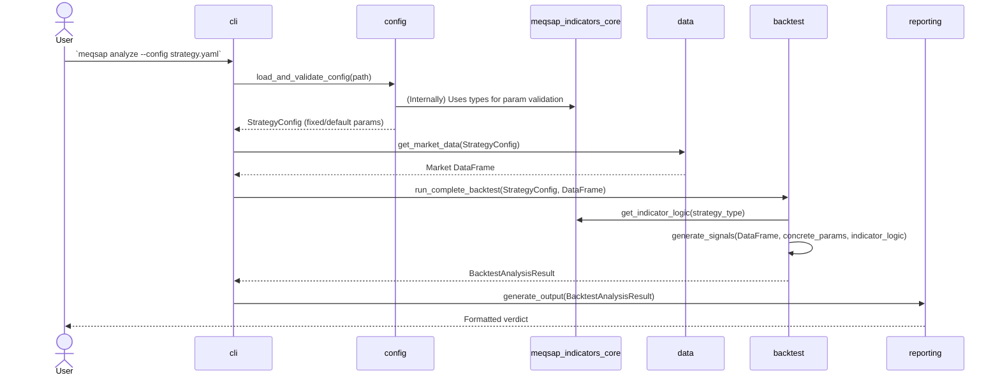
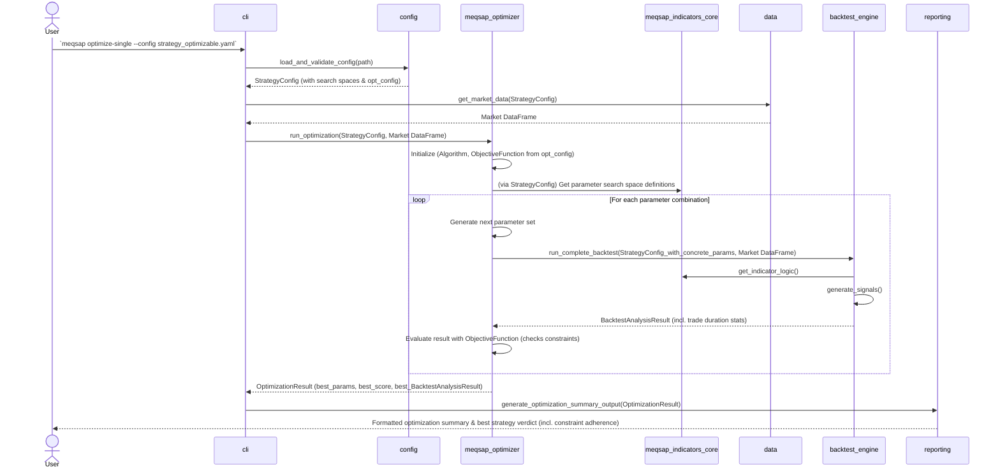

```markdown
# MEQSAP Architecture Document - v2.2

## Technical Summary

This document outlines the architecture for the Minimum Viable Quantitative Strategy Analysis Pipeline (MEQSAP). The system is designed as a command-line tool that orchestrates a suite of powerful, existing Python libraries to provide an end-to-end backtesting and analysis workflow. It takes a simple YAML configuration file as input, runs a backtest, performs a series of validation and robustness checks, and presents a clear verdict in the terminal.

**Version 2.1 Update:** This version incorporated the **Enhanced Indicator & Parameter Definition Framework**, introducing `meqsap_indicators_core` for standardized indicator definition and flexible parameterization (ranges, choices, steps) to prepare for strategy optimization.

**Version 2.2 Update (Current):** This version incorporates **Phase 2: Parameter Optimization Engine (Single Indicator)** as defined in PRD v2.2. Key architectural changes include:
*   The introduction of a new internal module, **`meqsap_optimizer`**, responsible for automated parameter optimization of single-indicator strategies.
*   Support for optimization algorithms like Grid Search and Random Search.
*   An objective function framework within `meqsap_optimizer` to guide optimization, including support for constraints like target trade holding periods. This includes the explicit "SharpeWithHoldPeriodConstraint" objective function.
*   Enhancements to `StrategyConfig` to include an `optimization_config` block, with validation for parameter space definitions.
*   Updates to `BacktestResult` to include **mandatory** trade duration statistics.
*   A new CLI command `meqsap optimize-single` to invoke the optimization engine, which will provide **progress indicators** for long runs.
*   Reporting capabilities extended to summarize optimization outcomes, including **constraint adherence metrics** (especially hold period stats).
*   Clear **error handling strategies** for failures within optimization loops, ensuring user-friendly messages as per PRD US10.

The primary goal remains to validate a high-level orchestration approach, prioritizing rapid development and reliability by leveraging battle-tested components, now with capabilities for automated parameter tuning.

## High-Level Overview

The MEQSAP application is built as a **Monolithic** application contained within a **single repository**. This approach simplifies development, dependency management, and deployment for a command-line tool. Version 2.2 introduces the `meqsap_optimizer` module, further enhancing internal modularity.

The primary data flows are:

1.  **Analysis Path (existing):**
    *   User invokes `meqsap analyze`, providing a strategy `.yaml` file (with fixed or default parameters from search spaces).
    *   Configuration is loaded and validated via `config` module (using `meqsap_indicators_core` for parameter understanding).
    *   Market data is acquired via `data` module (using `yfinance` and caching).
    *   Backtest is run by `backtest` module (using `vectorbt` and indicator logic from `meqsap_indicators_core`).
    *   Results are presented by `reporting` module.

2.  **Optimization Path (New for v2.2):**
    *   User invokes `meqsap optimize-single`, providing a strategy `.yaml` file that includes parameter search spaces and an `optimization_config` block.
    *   Configuration is loaded and validated by `config` module, including the `optimization_config` and parameter space definitions (e.g., range start < stop, step > 0; choices not empty).
    *   The `meqsap_optimizer` module takes over:
        *   It uses the defined parameter search spaces (from `meqsap_indicators_core` via `StrategyConfig`) and the `optimization_config`.
        *   It iteratively generates parameter sets using the chosen algorithm (e.g., Grid Search), providing **progress feedback** to the user via the CLI during long runs.
        *   For each parameter set, it invokes `run_complete_backtest` (from `meqsap.backtest`) to get performance and trade duration statistics. It **handles individual backtest failures gracefully** (e.g., logs error, skips combination, continues if feasible, or terminates with a summary of completed work and error details).
        *   It evaluates these results against the specified objective function, which incorporates constraint handling (e.g., penalizing strategies violating hold period constraints).
        *   It identifies and reports the best parameter set found.
    *   Results, including the best parameters, their performance, and constraint adherence, are presented by the `reporting` module.

```mermaid
graph TD
    subgraph "User Interaction"
        A[Strategist] --invokes `analyze`--> B{MEQSAP CLI};
        A --invokes `optimize-single`--> B;
    end

    subgraph "MEQSAP Core - Analysis Path"
        B --.yaml (fixed/default params)--> C[1. Load & Validate Config (config.py)];
        C --uses--> MIC((meqsap_indicators_core));
        C --uses--> D[Pydantic Schema];
        C --on success--> E[2. Acquire Data (data.py)];
        E --checks--> F[(File Cache)];
        F --on miss--> G(yfinance API);
        G --stores--> F;
        F --provides data--> H[3. Run Backtest (backtest.py)];
        E --provides data--> H;
        H --uses vectorbt & indicator logic from--> MIC;
        H --generates--> I[Signals & Stats];
        I --results--> J[4. Present Verdict & Report (reporting.py)];
    end
    
    subgraph "MEQSAP Core - Optimization Path (v2.2)"
        B --.yaml (param spaces & opt_config)--> C;
        C --Validated Config & Opt Config--> Optimizer[meqsap_optimizer];
        Optimizer --uses param spaces from (Config -> IndicatorsCore)--> MIC;
        Optimizer --iteratively calls (with progress reporting & error handling)--> H;
        H --BacktestAnalysisResult (incl. trade duration)--> Optimizer;
        Optimizer --evaluates with Objective Function (incl. constraint checks)--> Optimizer;
        Optimizer --Best Params & Results--> J;
    end

    subgraph "Output"
        J --uses rich--> K[Formatted Terminal Verdict/Optimization Summary (incl. progress, constraint adherence)];
        J --'--report' flag & uses pyfolio--> L((PDF Tear Sheet for best strategy));
    end
```

## Architectural / Design Patterns Adopted

The following high-level patterns guide the system's design:

*   **Pattern 1: Modular Monolith**
    *   **Rationale:** A single deployable unit, ideal for a CLI tool. Structured into distinct modules (`config`, `data`, `backtest`, `reporting`, `indicators_core`, and new `optimizer`) with clear boundaries, promoting separation of concerns, maintainability, and testability.

*   **Pattern 2: Orchestration & Facade**
    *   **Rationale:** MEQSAP acts as a simplifying facade to underlying libraries (`vectorbt`, `pyfolio`, etc.) and internal modules (`meqsap_indicators_core`, `meqsap_optimizer`). Supports rapid, high-level development.

*   **Pattern 3: Declarative Configuration**
    *   **Rationale:** Users declare strategy parameters, search spaces, and optimization settings in `.yaml`. Application interprets this, separating definition from logic.

*   **Pattern 4: Schema-Driven Validation (using Data Transfer Objects)**
    *   **Rationale:** Pydantic defines strict schemas for YAML (including parameter types, `optimization_config`, and parameter space definitions). `meqsap_indicators_core` contributes to indicator parameter validation. The `config` module validates parameter space structures. Ensures input integrity and clear error feedback.

*   **Pattern 5: Caching**
    *   **Rationale:** File-based caching for market data improves performance. (Future: Could cache optimization intermediate results).

*   **Pattern 6: Library-based Componentization**
    *   **Rationale:** `meqsap_indicators_core` and `meqsap_optimizer` are dedicated internal modules/libraries promoting high cohesion for their respective domains and loose coupling with the main application flow. Enhances modularity and prepares for advanced features.

*   **Pattern 7: Strategy Pattern (within Optimizer)**
    *   **Rationale:** The `meqsap_optimizer` can use different optimization algorithms (Grid Search, Random Search) and objective functions interchangeably, fitting the Strategy design pattern. This supports future expansion with advanced algorithms (Roadmap Phase 9).

## Component View

The MEQSAP application comprises the following primary modules:

*   **`config` Module:** Loads strategy `.yaml` files. Utilizes `meqsap_indicators_core` for indicator parameter definitions. Parses and validates the `optimization_config` block. **Crucially, it validates the structure of parameter space definitions** (e.g., for a range: `start < stop`, `step > 0`; for choices: list is not empty) against Pydantic models and potentially against constraints defined in `IndicatorBase` if applicable at this stage.
*   **`data` Module:** Handles market data acquisition (`yfinance`), caching, and integrity checks.
*   **`meqsap_indicators_core` Module:** Standardizes definition, parameterization (fixed, range, choice), validation, and calculation logic for technical indicators. Used by `config` and `backtest`. This modularity supports easy expansion of the indicator suite (Roadmap Phase 4).
*   **`backtest` Module:** Core backtesting engine.
    *   `StrategySignalGenerator` uses `meqsap_indicators_core` for indicator logic and accepts concrete parameter sets.
    *   Executes backtests using `vectorbt`.
    *   `run_backtest` and `run_complete_backtest` now populate enhanced `BacktestResult` with **mandatory** trade duration statistics. Trade durations are calculated from `vectorbt`'s `trades.records_readable` (e.g., `(trades.exit_timestamp - trades.entry_timestamp).dt.days`). `avg_trade_duration_days` is the mean of these durations. `pct_trades_in_target_hold_period` is calculated by comparing each trade's duration against `min_hold_days` and `max_hold_days` (if provided in `objective_params`).
*   **`meqsap_optimizer` Module (New for v2.2):** Responsible for automated parameter optimization for single-indicator strategies.
    *   **Engine:** Orchestrates the optimization loop. Provides **progress reporting** to the CLI during long runs. **Handles individual backtest failures** within the loop gracefully (e.g., logs error, skips combination, continues if feasible, or terminates with a summary of completed work and error details, aligning with PRD US10).
    *   **Algorithms:** Implements Grid Search, Random Search (initially).
    *   **Objective Functions:** Defines and evaluates objectives. Includes the explicit **"SharpeWithHoldPeriodConstraint"** function. Objective functions integrate trade duration statistics from `BacktestResult` into their scoring. For example, `SharpeWithHoldPeriodConstraint` might apply a penalty (e.g., multiplicative factor like 0.5, or a large negative adjustment) to the Sharpe ratio if `avg_trade_duration_days` or `pct_trades_in_target_hold_period` fall outside configured `objective_params` (e.g., `min_hold_days`, `max_hold_days`). A registry (e.g., `OBJECTIVE_REGISTRY` dictionary in `objective_functions.py`) maps YAML names to function implementations.
    *   Consumes `StrategyConfig` (parameter spaces from `indicators_core`, `optimization_config`).
    *   Calls `run_complete_backtest` from `backtest` module for each parameter set.
*   **`reporting` Module:** Presents results. For analysis path, shows standard backtest verdict. For optimization path, shows summary of optimization (best params, score, algorithm used, iterations) and detailed verdict for the best strategy. Optimization summary **explicitly includes constraint adherence metrics**, particularly hold period statistics (`avg_trade_duration_days`, `pct_trades_in_target_hold_period`) for the best strategy (PRD Epic4/Story6/AC4). Uses `rich` and `pyfolio`.
*   **`cli` Module:** Main entry point. Parses arguments, orchestrates workflows. New `optimize-single` command delegates to `meqsap_optimizer` and is responsible for **displaying progress updates** from the optimizer.

```mermaid
graph TD
    subgraph "Entrypoint"
        CLI
    end

    subgraph "Core Logic & Libraries"
        ConfigModule[config]
        IndicatorsCore[meqsap_indicators_core]
        DataModule[data]
        BacktestModule[backtest]
        OptimizerModule[meqsap_optimizer]
        ReportingModule[reporting]
    end

    subgraph "External Libraries"
        Pydantic
        PyYAML
        yfinance
        PandasTA["pandas-ta (via IndicatorsCore)"]
        vectorbt
        rich
        pyfolio
        # Potentially scikit-optimize in future for OptimizerModule
    end

    subgraph "Output"
        TerminalOutput[Terminal Verdict / Opt. Summary (incl. progress, constraint adherence)]
        PDFReport((PDF Report for Best Strategy))
    end

    CLI -- "analyze" / "optimize-single" --> ConfigModule
    ConfigModule --uses--> Pydantic
    ConfigModule --uses for indicator defs & validation--> IndicatorsCore
    ConfigModule --Validated Config--> DataModule
    ConfigModule --Validated Config & Opt.Settings--> OptimizerModule

    DataModule --uses--> yfinance
    DataModule --Market Data--> BacktestModule
    
    OptimizerModule --uses param spaces from (Config -> IndicatorsCore)--> IndicatorsCore
    OptimizerModule --runs backtests for param sets via (with progress updates to CLI)--> BacktestModule
    BacktestModule --BacktestAnalysisResult (incl. trade duration)--> OptimizerModule
    OptimizerModule --Best params & results--> ReportingModule

    BacktestModule --uses for indicator logic & calculation--> IndicatorsCore
    IndicatorsCore --may wrap--> PandasTA
    BacktestModule --uses--> vectorbt
    BacktestModule --Raw Results (for analyze path)--> ReportingModule
    
    ReportingModule --uses--> rich
    ReportingModule --uses--> pyfolio
    ReportingModule --> TerminalOutput
    ReportingModule --> PDFReport
```

## Project Structure

The project uses a standard `src` layout. `meqsap_indicators_core` and `meqsap_optimizer` are internal modules.

```plaintext
meqsap/
├── .github/
│   └── workflows/
│       └── main.yml
├── docs/
│   ├── adr/
│   ├── policies/
│   ├── architecture.md         # This architecture document (v2.2)
│   ├── prd.md                  # Product Requirements Document (v2.2)
│   └── roadmap.md              # Project Roadmap
├── examples/
│   ├── ma_crossover.yaml
│   ├── ma_crossover_v2.1.yaml
│   └── ma_crossover_v2.2_optimizable.yaml # Example with optimization_config (NEW)
├── src/
│   └── meqsap/
│       ├── __init__.py
│       ├── backtest.py           # Core backtesting, StrategySignalGenerator, BacktestResult enhanced
│       ├── cli.py                # Main CLI entrypoint, new 'optimize-single' command
│       ├── config.py             # Pydantic schema, YAML loading, StrategyConfig with opt_config
│       ├── data.py               # Data acquisition and caching
│       ├── exceptions.py         # Custom application exceptions
│       ├── reporting.py          # Terminal output and PDF generation, opt. summary
│       ├── indicators_core/      # Indicator definitions and logic
│       │   ├── __init__.py
│       │   ├── base.py
│       │   ├── parameters.py
│       │   ├── registry.py
│       │   └── indicators/
│       │       └── ...
│       ├── optimizer/            # NEW: meqsap_optimizer module
│       │   ├── __init__.py
│       │   ├── engine.py         # Core optimization engine
│       │   ├── algorithms/       # GridSearch, RandomSearch implementations
│       │   │   ├── __init__.py
│       │   │   ├── base_optimizer.py
│       │   │   ├── grid_search.py
│       │   │   └── random_search.py
│       │   ├── objective_functions.py # Sharpe, Calmar, custom, constraint handling, OBJECTIVE_REGISTRY
│       │   └── opt_config_models.py   # Pydantic models for optimization_config block
│       └── py.typed
├── tests/
│   ├── __init__.py
│   ├── test_backtest.py
│   ├── test_config.py
│   ├── indicators_core/
│   │   └── ...
│   ├── optimizer/              # NEW: Tests for the optimizer module
│   │   ├── __init__.py
│   │   ├── test_engine.py
│   │   ├── test_algorithms.py
│   │   └── test_objective_functions.py
│   └── ...
├── .gitignore
├── pyproject.toml
├── README.md
└── requirements.txt
```

## Definitive Tech Stack Selections

| Category                 | Technology                | Version / Details         | Description / Purpose                                                                                                | Justification                                                                         |
| :----------------------- | :------------------------ | :------------------------ | :------------------------------------------------------------------------------------------------------------------- | :------------------------------------------------------------------------------------ |
| **Languages** | Python                    | 3.9+                      | Primary language.                                                                                                    | Specified.                                                                            |
| **CLI Framework** | Typer                     | Latest                    | Robust CLI building.                                                                                                 | Integrates well with Pydantic.                                                        |
| **Data Handling** | pandas                    | Latest                    | Core data manipulation.                                                                                              | Industry standard.                                                                    |
|                          | yfinance                  | Latest                    | Historical OHLCV data.                                                                                               | Meets requirements.                                                                   |
| **Technical Analysis** | pandas-ta                 | Latest                    | TA indicators, wrapped by `meqsap_indicators_core`.                                                                  | Comprehensive TA library.                                                             |
| **Backtesting** | vectorbt                  | Latest                    | Core vectorized backtesting.                                                                                         | Powerful, modern.                                                                     |
| **Configuration** | PyYAML                    | Latest                    | Secure YAML loading.                                                                                                 | Standard and secure.                                                                  |
|                          | Pydantic                  | Latest                    | Schema definition and validation for config, params, and `optimization_config`.                                    | Enforces data integrity.                                                              |
| **Reporting & UI** | rich                      | Latest                    | Formatted terminal output, progress indicators.                                                                      | Polished CLI UX.                                                                      |
|                          | pyfolio                   | Latest                    | PDF tear sheets.                                                                                                     | Industry standard reporting.                                                          |
| **Internal Components** | `meqsap_indicators_core`  | N/A (Internal)            | Standardizes indicator definition, parameter types, search spaces, calculation.                                      | Modularity, maintainability, optimization readiness.                                  |
|                          | `meqsap_optimizer`        | N/A (Internal)            | Parameter optimization engine (Grid/Random Search, objectives, constraints).                                       | Implements Phase 2 (PRD v2.2) for automated parameter tuning.                         |
| **Testing** | pytest                    | Latest                    | Unit and integration testing.                                                                                        | De facto standard.                                                                    |
| **CI/CD** | GitHub Actions            | N/A                       | Automation.                                                                                                          | Well-integrated.                                                                      |

## API Reference

### External APIs Consumed
*   **`yfinance` API**: For historical market data. (No change)

### Internal APIs Provided
Not applicable. MEQSAP is a self-contained command-line tool.

## Data Models

Key data models are strategy configuration and backtest results.

*   **`StrategyConfig`** (`meqsap.config`):
    *   Represents the complete configuration for a run, loaded from YAML.
    *   Includes `ticker`, `start_date`, `end_date`, `strategy_type`, `strategy_params` (which can be fixed values or parameter space definitions from `meqsap_indicators_core.parameters`). Parameter space definitions are validated by Pydantic models in `meqsap.indicators_core.parameters` and potentially further by `config.py` if needed.
    *   **New for v2.2:** Includes an optional `optimization_config: OptimizationConfig` block (defined in `meqsap.optimizer.opt_config_models`) when the `optimize-single` command is used. This block details algorithm, objective function, and their respective parameters.

*   **`OptimizationConfig`** (`meqsap.optimizer.opt_config_models` - New Pydantic model):
    *   `active`: bool
    *   `algorithm`: str (e.g., "GridSearch", "RandomSearch")
    *   `objective_function`: str (e.g., "SharpeRatio", "SharpeWithHoldPeriodConstraint")
    *   `objective_params`: Dict (e.g., `min_hold_days`, `max_hold_days`, penalty factors)
    *   `algorithm_params`: Dict (e.g., `random_search_iterations`)

*   **Indicator & Parameter Definitions** (`meqsap_indicators_core`): (No change from v2.1, foundational for optimizer)
    *   `IndicatorBase`, `ParameterDefinition`, `ParameterSpace`, `ParameterRange`, `ParameterChoices`, `ParameterValue`.

*   **`BacktestResult`** (`meqsap.backtest`):
    *   Holds detailed performance metrics from a single backtest run.
    *   **Enhanced for v2.2 (Mandatory Fields):**
        *   `avg_trade_duration_days: float`
        *   `pct_trades_in_target_hold_period: float`
        *   **Calculation Methodology:**
            *   Trade durations are calculated from `vectorbt`'s `trades.records_readable` using `(trades.exit_timestamp - trades.entry_timestamp).dt.days`.
            *   `avg_trade_duration_days` is the mean of these individual trade durations. If no trades, this can be 0.0 or NaN (to be handled by objective functions).
            *   `pct_trades_in_target_hold_period` is calculated by iterating through `trade_details` (which store individual trade durations), comparing each duration against `min_hold_days` and `max_hold_days` (if these are provided via `objective_params` in the `optimization_config`), and then computing the percentage of trades falling within this target range. If no target range is specified, this can be 0.0 or NaN.
        *   These trade duration statistics are crucial for enabling advanced objective functions and future features like the Strategy Doctor (Roadmap Phase 8).

*   **`OptimizationResult`** (`meqsap_optimizer` - New Pydantic model):
    *   Holds results from an optimization run.
    *   `best_params`: Dict of the best parameter set found.
    *   `best_score`: The objective score achieved by `best_params`.
    *   `best_backtest_analysis_result`: Full `BacktestAnalysisResult` for the best parameters.
    *   `optimization_summary`: Algorithm used, number of iterations, etc.
    *   `constraint_adherence_report`: How well constraints like hold period were met by the best strategy (includes `avg_trade_duration_days` and `pct_trades_in_target_hold_period` for the best strategy).

## Core Workflow / Sequence Diagrams

### Analysis Path (`meqsap analyze`)
(No change from v2.1 - this path uses fixed or default parameters)



### Optimization Path (`meqsap optimize-single`) - New for v2.2



## Coding Standards
(No changes from original: `snake_case`, `PascalCase`, type hints, `mypy`, `logging`.)
The new `meqsap_optimizer` module will also adhere to these standards.

## Overall Testing Strategy
(No major changes to strategy, but new test scope.)
*   **Tools:** `pytest`.
*   **Unit Tests:** For `meqsap_optimizer` components (algorithms, objective functions, engine logic), `config` (parsing `optimization_config` and parameter space validation), `backtest` (trade duration stats).
*   **Integration Tests:** Test interactions between `cli`, `optimizer`, `backtest`, `config`.
*   **End-to-End (E2E) Tests:** Validate `optimize-single` CLI flow with example YAMLs, including progress reporting and error handling within loops.

## Security Best Practices
(No changes from original: Pydantic for YAML validation, `yaml.safe_load()`.)
Validation of `optimization_config` values and parameter space definitions is important.

## Future Considerations & Technical Debt

*   **Parallel Execution for Optimization:** The current design for `meqsap_optimizer` is single-threaded. For larger parameter spaces or more complex objective functions, parallel execution of backtests within the optimization loop will be necessary to reduce runtime. This is planned for a future phase (e.g., Roadmap Phase 6) and is considered **technical debt (TD-ARCH-20250605-001)**. The architecture should be amenable to adding a parallel execution layer (e.g., using `joblib` or `multiprocessing`) within the `OptimizerEngine`.
*   **Advanced Optimization Algorithms:** While the Strategy Pattern in the optimizer supports new algorithms, implementing more advanced ones (Bayesian, Genetic) is deferred (Roadmap Phase 9).
*   **Optimization State Persistence:** The ability to interrupt and resume long optimization runs is out of scope for v2.2.

## Roadmap Linkages

The architectural decisions in v2.2 pave the way for future roadmap phases:
*   **Modular Indicators (`meqsap_indicators_core`):** Directly supports **Phase 4 (Expanding Indicator Suite)** by providing a standardized way to add and manage new indicators.
*   **Trade Duration Stats (in `BacktestResult`):** Essential for **Phase 8 (Automated Strategy Improvement - Heuristic Diagnostics & Modifications)**, as the "Strategy Doctor" will need detailed trade characteristics to diagnose issues and suggest improvements related to holding periods.
*   **Optimizer's Strategy Pattern:** The flexible design for algorithms and objective functions in `meqsap_optimizer` facilitates the integration of **Phase 9 (Advanced Optimization Techniques)**.
```