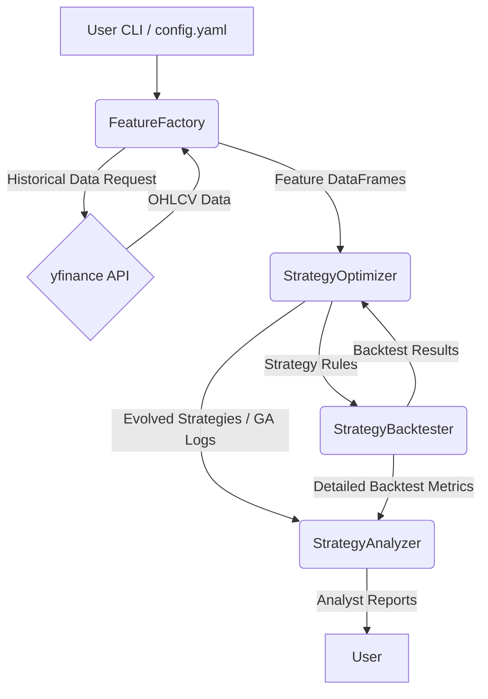
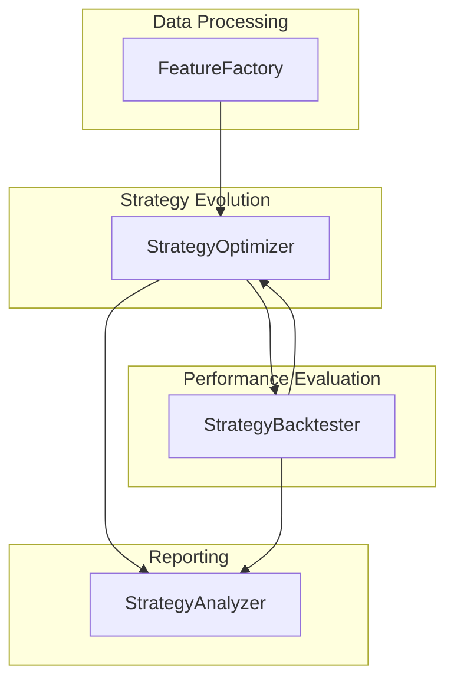
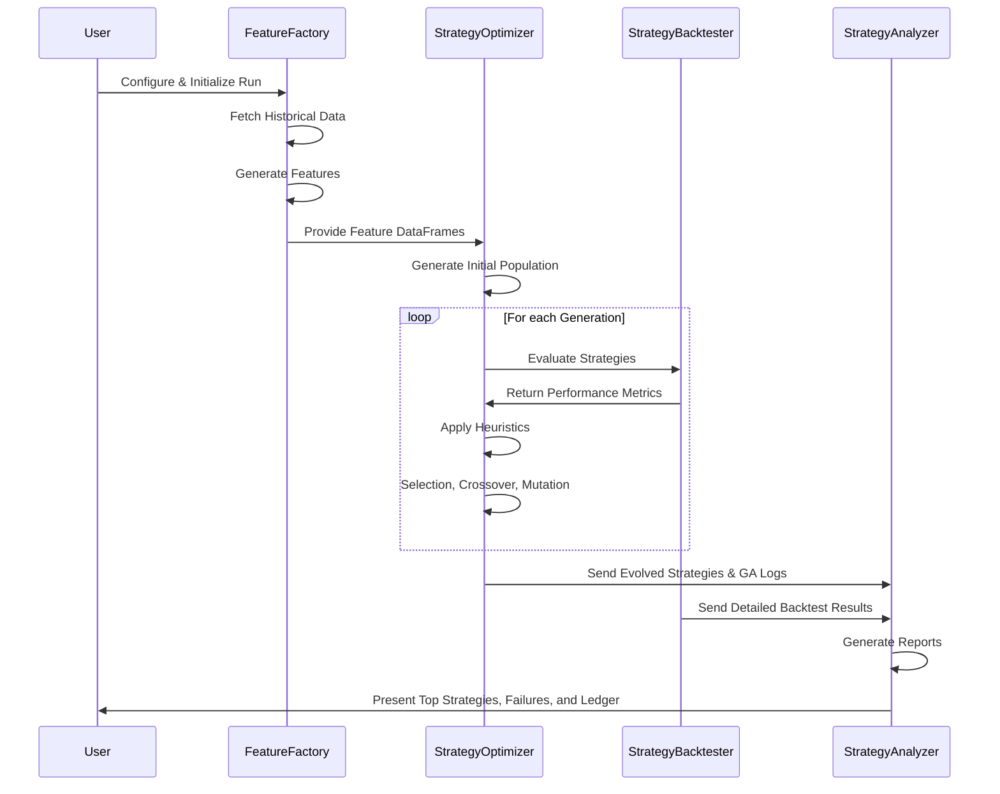

# Adaptive Automated Trading Strategy Discovery System Architecture Document

## Technical Summary

The Adaptive Automated Trading Strategy Discovery System is a Python-based solution designed to autonomously discover, evaluate, and evolve short-term trading strategies for Indian large-cap and mid-cap NSE equity stocks. The system leverages genetic algorithms (GA), heuristic analysis, and robust backtesting to iteratively refine strategies, focusing on swing trading timeframes (3 days to 4 weeks). The architecture follows a modular design with four core components working together to discover strategies that demonstrate profitability and robustness across multiple unrelated stocks, avoiding overfitting to a single instrument.

## High-Level Overview

The system follows a data processing pipeline architecture with genetic algorithm optimization at its core. The primary workflow involves fetching stock data, generating technical indicators, evolving strategies through GA, backtesting across multiple stocks, and generating human-readable reports for analysis.

## Component View

The system consists of four major logical components that work together to discover, evaluate, and report on trading strategies.

- **FeatureFactory**: Responsible for fetching historical NSE equity data (OHLCV) via yfinance, implementing local caching, and generating technical indicators (features) like Moving Averages, RSI, MACD, Bollinger Bands, ATR, and volume indicators.

- **StrategyOptimizer**: Core GA engine that generates, evaluates, and evolves trading strategies. It defines strategy structure, manages the GA population, implements heuristic mechanisms for strategy evaluation, and tracks strategy performance across multiple stocks.

- **StrategyBacktester**: Evaluates strategies on historical data, incorporating transaction costs, slippage, and position sizing. It calculates key performance metrics both per stock and aggregated for multi-stock validation.

- **StrategyAnalyzer**: Consumes outputs from the Optimizer and Backtester to generate human-readable reports (Top Strategies, Failures, Strategy Ledger) for analyst review.

- **src/ Directory**: The application code in src/ is organized into logical modules corresponding to the main components, with shared utilities, common data structures, and configuration handling.

## Key Architectural Decisions & Patterns

- **Data Pipeline Architecture**: A sequential processing pipeline where data flows from raw stock data to features to strategy evaluation to reporting, enabling efficient processing and clear separation of concerns. - Justification: This pattern allows for modular development, clear interfaces between components, and easier testing.

- **Genetic Algorithm for Strategy Evolution**: Using GAs rather than exhaustive search or fixed rule templates to discover trading strategies. - Justification: The search space of potential strategies is vast, and GA provides an efficient method to explore and evolve strategies based on multiple success criteria.

- **Multi-Stock Fitness Evaluation**: Strategies are evaluated across multiple unrelated stocks to ensure generalizability. - Justification: This prevents overfitting to a single instrument, which is a common issue in trading strategy development.

- **Heuristic-Guided Strategy Evolution**: Using domain-specific heuristics to guide the GA beyond raw performance metrics. - Justification: Pure performance metrics can lead to overfitted strategies; heuristics incorporate domain knowledge to produce more robust strategies.

- **Local Caching with Verification**: Implementing resilient caching for yfinance data with checksums. - Justification: Reduces API calls, speeds up testing, and ensures data integrity during development.

- **Configuration-Driven Behavior**: Extensive use of external configuration rather than hardcoded parameters. - Justification: Allows users to customize runs without code changes and supports reproducible experiments.

## Core Workflow / Sequence Diagrams

## Infrastructure and Deployment Overview

- Cloud Provider(s): N/A (Local execution for MVP)
- Core Services Used: N/A
- Infrastructure as Code (IaC): N/A
- Deployment Strategy: Local installation via Python environment setup
- Environments: Local Development/Testing (Windows focus for MVP)

## Key Reference Documents

- docs/prd.md
- docs/tech-stack.md
- docs/project-structure.md
- docs/coding-standards.md
- docs/data-models.md
- docs/environment-vars.md
- docs/testing-strategy.md

## Change Log

| Change        | Date       | Version | Description                  | Author         |
| ------------- | ---------- | ------- | ---------------------------- | -------------- |
| Initial draft | 2025-05-15 | 0.1     | Initial draft based on PRD   | AI Architect   | 