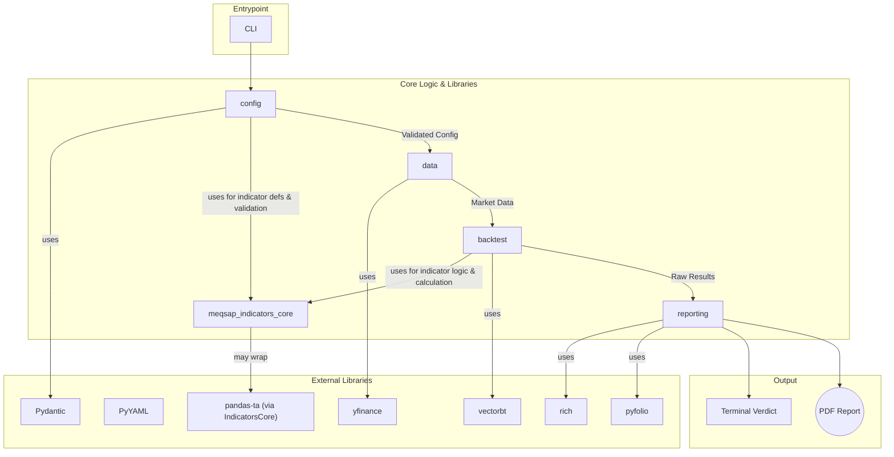
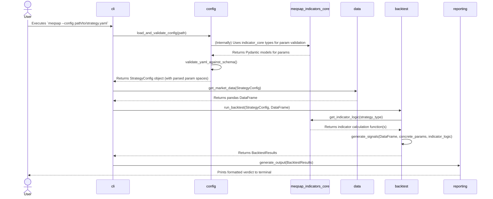

Okay, I'm Fred, your Architect. I understand the task. You want me to update the existing MEQSAP Architecture Document to incorporate the changes detailed in **Phase 1: Enhanced Indicator & Parameter Definition Framework** from the provided `roadmap.md` and reflected in the `prd.md` (v2.1).

I will focus on making the architecture reflect these Phase 1 changes comprehensively, ensuring the system is well-prepared for subsequent phases of the roadmap.

Here is the updated MEQSAP Architecture Document:

```markdown
# MEQSAP Architecture Document - v2.1

## Technical Summary

This document outlines the architecture for the Minimum Viable Quantitative Strategy Analysis Pipeline (MEQSAP). The system is designed as a command-line tool that orchestrates a suite of powerful, existing Python libraries to provide an end-to-end backtesting and analysis workflow. It takes a simple YAML configuration file as input, runs a backtest, performs a series of validation and robustness checks, and presents a clear verdict in the terminal.

**Version 2.1 Update:** This version of the architecture incorporates **Phase 1: Enhanced Indicator & Parameter Definition Framework**. Key changes include:
* The introduction of a new internal library/module, **`meqsap_indicators_core`**, to standardize the definition, parameterization (including ranges, choices, steps), and calculation logic of technical indicators.
* Refactoring of core components (`config`, `backtest`) to utilize `meqsap_indicators_core` for enhanced modularity and to support flexible parameter definitions in preparation for future automated strategy optimization.
* Updates to data models to accommodate these new parameter types.

The primary goal remains to validate a high-level orchestration approach, prioritizing rapid development and reliability by leveraging battle-tested components, now with an enhanced focus on modularity and extensibility for indicator management.

## High-Level Overview

The MEQSAP application will be built as a **Monolithic** application contained within a **single repository**. This approach was chosen for the MVP to simplify development, dependency management, and deployment for a command-line tool. Version 2.1 maintains this overall structure but enhances internal modularity with the `meqsap_indicators_core` module.

The primary data flow is as follows:
1.  The user invokes the CLI, providing a path to a strategy `.yaml` file. This YAML can now define fixed parameters as well as parameter search spaces (ranges, choices, steps) for indicators.
2.  The application loads and validates this configuration using a Pydantic schema, leveraging `meqsap_indicators_core` for understanding and validating indicator-specific parameter definitions.
3.  It then acquires historical market data via `yfinance`, utilizing a local file-based cache to speed up subsequent runs. The required data coverage calculation now considers potential maximums from parameter ranges.
4.  The core backtesting engine, powered by `vectorbt`, processes the data and strategy rules (using indicator logic from `meqsap_indicators_core` and concrete parameter sets) to generate performance results.
5.  Finally, a presentation layer uses `rich` to display a formatted "Executive Verdict" in the terminal and can optionally generate a detailed PDF tear sheet with `pyfolio`.

```mermaid
graph TD
    subgraph "User Interaction"
        A[Strategist] --invokes--> B{MEQSAP CLI};
    end

    subgraph "MEQSAP Core Pipeline"
        B --.yaml config (with param spaces)--> C[1. Load & Validate Config];
        C --uses--> MIC((meqsap_indicators_core));
        C --uses--> D[Pydantic Schema];
        C --on success--> E[2. Acquire Data];
        E --checks--> F[(File Cache)];
        F --on miss--> G(yfinance API);
        G --stores--> F;
        F --provides data--> H[3. Run Backtest];
        E --provides data--> H;
        H --uses vectorbt & indicator logic from--> MIC;
        H --generates--> I[Signals & Stats];
        I --results--> J[4. Present Verdict & Report];
    end

    subgraph "Output"
        J --uses rich--> K[Formatted Terminal Verdict];
        J --'--report' flag & uses pyfolio--> L((PDF Tear Sheet));
    end
```

## Architectural / Design Patterns Adopted

The following high-level patterns have been chosen to guide the system's design and ensure the project's goals are met efficiently.

* **Pattern 1: Modular Monolith**
    * **Rationale:** The application is a single deployable unit (a monolith), ideal for a self-contained CLI tool. It's structured into distinct modules (`config`, `data`, `backtest`, `reporting`, and the new `indicators_core`) with clear boundaries. This enforces strong separation of concerns, making the codebase easier to maintain, test, and extend, especially with the formalized indicator management.

* **Pattern 2: Orchestration & Facade**
    * **Rationale:** MEQSAP acts as a simplifying facade to underlying libraries (`vectorbt`, `pyfolio`, etc.) and now also to the `meqsap_indicators_core` for indicator logic. This supports rapid, high-level development.

* **Pattern 3: Declarative Configuration**
    * **Rationale:** Users declare strategy parameters (now including search spaces) in a `.yaml` file. The application interprets this for execution, separating strategy definition from execution logic.

* **Pattern 4: Schema-Driven Validation (using Data Transfer Objects)**
    * **Rationale:** Pydantic defines strict schemas for YAML configuration (including new parameter types), ensuring input validation and clear error feedback. `meqsap_indicators_core` contributes to this by providing schemas/validation for indicator parameters.

* **Pattern 5: Caching**
    * **Rationale:** File-based caching for market data improves performance and reduces API calls.

* **Pattern 6: Library-based Componentization (New/Enhanced for v2.1)**
    * **Rationale:** The introduction of `meqsap_indicators_core` as a dedicated internal library/module for handling all aspects of technical indicators (definition, parameterization, calculation) promotes high cohesion for indicator logic and loose coupling with the main application flow. This directly enhances modularity, maintainability, and testability, and prepares the system for more advanced features like automated strategy discovery.

## Component View

The MEQSAP application is composed of the following primary modules:

* **`config` Module:** Responsible for loading the strategy `.yaml` file. It now utilizes `meqsap_indicators_core` to interpret, validate, and manage indicator parameter definitions, including fixed values and search spaces (ranges, choices, steps) against a strict Pydantic schema. Handles `BaseStrategyParams` and `StrategyConfig` logic.
* **`data` Module:** Handles acquisition and management of historical market data via `yfinance`, including caching and integrity checks. The calculation of `get_required_data_coverage_bars` now considers maximum lookback from parameter ranges defined in `config`.
* **`meqsap_indicators_core` Module (New for v2.1):** A dedicated internal library/module responsible for:
    * Standardized definition of technical indicators (e.g., via `IndicatorBase` in `base.py`).
    * Management of indicator parameters, their types (fixed, range, choice via `ParameterDefinition`), validation, and search space descriptions (`ParameterSpace`).
    * Providing calculation logic for indicators (wrapping `pandas-ta` or custom implementations).
    * A registry or mechanism for discovering and accessing available indicators.
* **`backtest` Module:** The core engine. Takes prepared data and strategy configuration. The `StrategySignalGenerator` (or equivalent) is adapted to:
    * Utilize `meqsap_indicators_core` to dynamically fetch indicator calculation logic.
    * Accept concrete parameter sets (which could be drawn from defined search spaces or be fixed values) for generating trading signals.
    * Executes the backtest (using `vectorbt`) and runs robustness "Vibe Checks".
* **`reporting` Module:** Takes raw results from `backtest` for user-facing output (terminal verdict via `rich`, PDF report via `pyfolio`). No direct interaction with `meqsap_indicators_core`.
* **`cli` Module:** Main entry point, parses arguments, and orchestrates the workflow by calling other modules.

This component-based structure is visualized below:



## Project Structure

The project will be organized using a standard `src` layout. The new `meqsap_indicators_core` module will initially reside within the main `meqsap` package structure but is designed for potential future separation.

```plaintext
meqsap/
├── .github/
│   └── workflows/
│       └── main.yml
├── .venv/
├── docs/
│   ├── adr/
│   │   └── ...
│   ├── policies/
│   │   └── ...
│   ├── architecture.md         # This architecture document (v2.1)
│   └── prd.md                  # Product Requirements Document (v2.1)
│   └── roadmap.md              # Project Roadmap
├── examples/
│   ├── ma_crossover.yaml
│   └── ma_crossover_v2.1.yaml  # Example config with parameter spaces (NEW)
├── src/
│   └── meqsap/
│       ├── __init__.py
│       ├── backtest.py           # Core backtesting, StrategySignalGenerator
│       ├── cli.py                # Main CLI entrypoint
│       ├── config.py             # Pydantic schema, YAML loading, BaseStrategyParams, StrategyConfig
│       ├── data.py               # Data acquisition and caching
│       ├── exceptions.py         # Custom application exceptions
│       ├── reporting.py          # Terminal output and PDF generation
│       ├── indicators_core/      # NEW: meqsap_indicators_core module
│       │   ├── __init__.py       # Exports key components
│       │   ├── base.py           # IndicatorBase, ParameterDefinition (metadata), ParameterSpace
│       │   ├── parameters.py     # Pydantic models for ParameterRange, ParameterChoices, ParameterValue
│       │   ├── registry.py       # Indicator registry/factory
│       │   └── indicators/       # Concrete indicator implementations (e.g., moving_average.py, rsi.py)
│       │       ├── __init__.py
│       │       ├── ma.py
│       │       └── rsi.py
│       └── py.typed
├── tests/
│   ├── __init__.py
│   ├── test_backtest.py
│   ├── test_config.py
│   ├── indicators_core/        # NEW: Tests for the indicators_core module
│   │   ├── __init__.py
│   │   ├── test_parameters.py
│   │   ├── test_base.py
│   │   └── indicators/ ...
│   └── ...
├── .gitignore
├── pyproject.toml
├── README.md
└── requirements.txt
```

### Key Directory Descriptions

* **`docs/`**: Contains all project planning and reference documentation.
* **`src/meqsap/`**: The main Python package.
    * **`src/meqsap/indicators_core/`**: The new module for standardized indicator definition, parameterization, and calculation logic. It aims to be self-contained regarding indicator logic, potentially wrapping libraries like `pandas-ta`.
* **`tests/`**: Contains all automated tests, mirroring the `src/meqsap` package structure, including new tests for `indicators_core`.
* **`pyproject.toml`**: Project metadata and build configuration.
* **`requirements.txt`**: Frozen project dependencies.

## Definitive Tech Stack Selections

| Category                 | Technology                | Version / Details         | Description / Purpose                                                                                                | Justification (Optional)                                                                      |
| :----------------------- | :------------------------ | :------------------------ | :------------------------------------------------------------------------------------------------------------------- | :-------------------------------------------------------------------------------------------- |
| **Languages** | Python                    | 3.9+                      | Primary language for the entire application.                                                                       | Specified in project requirements.                                                          |
| **CLI Framework** | Typer                     | Latest                    | For building a robust and user-friendly command-line interface.                                                      | Integrates well with Pydantic.                                                                |
| **Data Handling** | pandas                    | Latest                    | Core data manipulation and analysis.                                                                                 | Industry standard.                                                                            |
|                          | yfinance                  | Latest                    | To download historical OHLCV data.                                                                                   | Meets the project's data source requirement.                                                |
| **Technical Analysis** | pandas-ta                 | Latest                    | To generate technical analysis indicators. Will be primarily wrapped/utilized by `meqsap_indicators_core`.       | Comprehensive library for TA.                                                                 |
| **Backtesting** | vectorbt                  | Latest                    | Core library for running fast, vectorized backtests.                                                               | Powerful, modern library central to the project.                                            |
| **Configuration** | PyYAML                    | Latest                    | To securely load the strategy `.yaml` configuration file.                                                          | Standard and secure.                                                                          |
|                          | Pydantic                  | Latest                    | For defining a strict schema and validating configuration, including new parameter types and indicator definitions.  | Enforces data integrity and provides clear validation errors.                                 |
| **Reporting & UI** | rich                      | Latest                    | To display formatted tables and text in the terminal.                                                              | Creates a polished CLI UX.                                                                    |
|                          | pyfolio                   | Latest                    | To generate institutional-grade PDF tear sheets for analysis.                                                      | Industry standard for performance reporting.                                                  |
| **Internal Components** | `meqsap_indicators_core`  | N/A (Internal Module)     | Standardizes indicator definition, parameter types (fixed, range, choice), search spaces, and calculation logic. | Enhances modularity, maintainability, and prepares for optimization (as per PRD v2.1).       |
| **Testing** | pytest                    | Latest                    | Framework for writing and running unit and integration tests.                                                      | De facto standard for Python testing.                                                         |
| **CI/CD** | GitHub Actions            | N/A                       | To automate testing and publishing to PyPI.                                                                        | Well-integrated for GitHub projects.                                                          |

## API Reference

### External APIs Consumed

* **`yfinance` API**
    * **Purpose:** To acquire historical OHLCV market data.
    * **Consumption Method:** Via the `yfinance` Python library.
    * **Authentication:** Not required for public historical data.
    * **Key Functions Used:** `yfinance.download()`.
    * **Rate Limits:** Subject to Yahoo! Finance's terms; caching mitigates this.
    * **Link to Official Docs:** [https://pypi.org/project/yfinance/](https://pypi.org/project/yfinance/)

### Internal APIs Provided (If Applicable)

Not applicable. MEQSAP is a self-contained command-line tool.

## Data Models

The primary data model is the strategy configuration. With v2.1, parameter definitions are enhanced.

### Core Application Entities / Domain Objects

* **`StrategyConfig`** (within `meqsap.config`)
    * **Description:** Represents the complete configuration for a backtest run, loaded from YAML. Now supports enhanced parameter definitions for strategy parameters.
    * **Schema / Pydantic Definition (Conceptual Example for `MovingAverageCrossoverParams` within `StrategyConfig`):**
        ```python
        from pydantic import BaseModel, Field, validator
        from typing import Union, List, Dict, Any

        # Parameter types that will be defined within meqsap_indicators_core
        # and used by BaseStrategyParams and its children.
        class ParameterRange(BaseModel): # Defined in meqsap.indicators_core.parameters
             type: str = "range"
             start: float
             stop: float
             step: float = 1.0
             # Add validation: start < stop, step > 0

        class ParameterChoices(BaseModel): # Defined in meqsap.indicators_core.parameters
             type: str = "choices"
             values: List[Any]
             # Add validation: non-empty list

        class ParameterValue(BaseModel): # Defined in meqsap.indicators_core.parameters
            type: str = "value"
             value: Any

         # Union type for parameter definitions
        ParameterDefinitionType = Union[float, int, str, bool, ParameterRange, ParameterChoices, ParameterValue]

        class MovingAverageCrossoverParams(BaseModel): # Child of BaseStrategyParams
            # Example: fast_ma can be a fixed number or a definition for a search space
            fast_ma: ParameterDefinitionType = Field(..., description="Fast moving average period or definition.")
            slow_ma: ParameterDefinitionType = Field(..., description="Slow moving average period or definition.")
            # other parameters...

            # Validator to ensure that if both are fixed numbers, slow_ma > fast_ma
            # Further validation will occur based on the 'type' field if dicts are provided.
            # Actual Pydantic models in meqsap_indicators_core will handle detailed validation
            # of range/choice structures.

        class StrategyConfig(BaseModel):
            ticker: str
            start_date: str
            end_date: str
            strategy_type: str # e.g., "MovingAverageCrossover" (consistent with StrategyConfig)
             strategy_params: Dict[str, Any] # This would be parsed into specific Param models
                                              # like MovingAverageCrossoverParams, which in turn use
                                              # ParameterDefinitionType for its fields.
            # The actual strategy_params field would likely be a Union of all
            # supported strategy parameter classes (e.g., Union[MovingAverageCrossoverParams, RSIParams])
            # or use a 'strategy_type' field to discriminate.
        ```
    * **Validation Rules:** Validation handled by Pydantic models. `meqsap_indicators_core` will provide robust models for `ParameterRange`, `ParameterChoices`, `ParameterValue` including attribute constraints (e.g., `start < stop`). `BaseStrategyParams` and its children will use these models for their parameter fields.

* **Indicator & Parameter Definitions** (within `meqsap_indicators_core.base` and `meqsap_indicators_core.parameters`)
    * **`IndicatorBase` (`base.py`):** Abstract base class for all indicators.
    * **`ParameterDefinition` (`base.py`):** Describes metadata for a single parameter (name, type, constraints, default value).
    * **`ParameterSpace` (`base.py`):** Defines the search space for a set of parameters for an indicator, using `ParameterDefinition` objects.
    * **`ParameterRange`, `ParameterChoices`, `ParameterValue` (`parameters.py`):** Pydantic models for defining parameter values or search spaces in configurations.
    * **`ParameterDefinitionType` (`parameters.py`):** Union type for all allowed parameter value/definition structures.

## Core Workflow / Sequence Diagrams

This sequence diagram illustrates interactions, including the new `meqsap_indicators_core`.



## Coding Standards

(No changes assumed from original, but `meqsap_indicators_core` will also adhere to these.)

* **Naming Conventions:** `snake_case` for variables/functions, `PascalCase` for classes, `UPPER_SNAKE_CASE` for constants.
* **Type Safety:** Python native type hints mandatory, `mypy` for static checking.
* **Dependency Management:** Explicitly defined and frozen in `requirements.txt`.
* **Logging:** Built-in `logging` module.

## Overall Testing Strategy

(No changes assumed from original scope, but new tests will be added.)

* **Tools:** `pytest`.
* **Unit Tests:** For custom orchestration logic in `meqsap` and for all logic within `meqsap_indicators_core` (e.g., parameter validation, indicator calculation wrappers).
* **Integration Tests:** Test interactions between `meqsap` modules and `meqsap_indicators_core`.
* **End-to-End (E2E) Tests:** Validate complete CLI flow with example YAMLs using new parameter definitions.

## Security Best Practices

(No changes assumed from original.)

* **Robust Input Validation:** Pydantic for YAML, now including validation for parameter space definitions via `meqsap_indicators_core`.
* **Safe Configuration Parsing:** Use `yaml.safe_load()`.
```