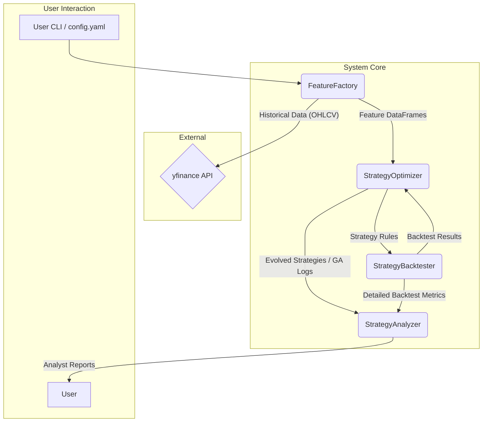

# Product Requirements Document (PRD) - v1.8 (Modified)

## Adaptive Automated Trading Strategy Discovery System

**Document Version:** 1.8 (Modified)
**Last Updated:** 2025-05-14

### Introduction

The Adaptive Automated Trading Strategy Discovery System is a Python-based solution designed to autonomously discover, evaluate, and evolve **short-term trading strategies**. These strategies typically have holding periods ranging from 3 days up to four weeks, with an initial MVP focus primarily on **swing trading** timeframes. The system is specifically tailored for **Indian large-cap and mid-cap NSE equity stocks**.

Leveraging genetic algorithms (GA), heuristic analysis, and robust backtesting, the system iteratively refines strategies, minimizing manual intervention and maximizing interpretability. This MVP provides retail traders and analysts (ranging from technically-inclined retail traders to quantitative analysts seeking idea generation) with a transparent, automated, and adaptive tool to systematically identify potentially profitable trading strategies without manual rule-writing. Execution is initially focused on local Windows environments, using a standard Python setup.

**A core objective is to identify strategies that demonstrate profitability and robustness across multiple (e.g., two or more) unrelated stocks, avoiding overfitting to a single instrument.** "Unrelated stocks" implies stocks from different sectors or those with historically low correlation; for MVP, the user will provide the list, but future iterations might incorporate mechanisms to suggest or ensure such diversity.

---

## Goals and Objectives

### Project Objectives

-   Automate discovery and evolution of potentially profitable short-term trading strategies for **Indian large-cap and mid-cap NSE equities**.
-   **Identify strategies that generalize well, providing positive returns across at least two or more distinct, ideally unrelated, stocks within the defined universe over a 3-day to 4-week holding period.**
-   Provide clear, interpretable strategies evolving based on historical performance and heuristic feedback.
-   Enable analysts to easily review and validate strategy evolution through concise, human-readable reports.
-   Ensure strategies demonstrate robustness, generalizability, and incorporate checks against overfitting to historical data and specific instruments.

### Measurable Outcomes

-   Reduction in manual effort required for strategy discovery and refinement.
-   Improvement in strategy performance metrics (net profit, Sharpe ratio, win rate, max drawdown) compared to defined baseline strategies, **demonstrated consistently across a small portfolio of diverse stocks rather than just a single stock.**
-   Increased analyst confidence in automated strategy evolution through clear reporting and transparency.
-   **Generation of a documented list of all tested strategies (Strategy Ledger), their performance, and failure rates on a per-stock basis, highlighting strategies deemed broadly ineffective.**

### Success Criteria

-   System autonomously generates and evolves strategies outperforming pre-defined simple baseline strategies **on a basket of at least 2-3 diverse large/mid-cap NSE stocks.**
    *   **Baseline 1 (Market Benchmark):** Buy-and-Hold on NIFTY 50 index.
    *   **Baseline 2 (Simple Technical Strategy):** Simple Moving Average (SMA) Crossover. **The specific parameters (e.g., 20-day SMA vs 50-day SMA) and the diverse basket of 5-10 representative Indian large/mid-cap NSE stocks (e.g., NIFTY 50/NIFTY Midcap 100 constituents from different sectors) will be explicitly defined, fixed, and documented within the main configuration file (`config.yaml`) for consistent and reproducible benchmarking.**
-   Analysts clearly understand strategy logic (rules, parameters), performance, evolution rationale (heuristic tags applied, major changes), and robustness from generated reports.
-   Strategies demonstrate robustness when tested across different historical periods, market conditions, **and multiple distinct stocks**, including passing validation across multiple segments within a defined test window.
-   **A strategy is considered potentially viable if it shows positive expectancy and acceptable risk metrics on at least two distinct stocks from the target universe.**
-   MVP Validation: Success will be validated by comparing the key performance metrics generated by the system's evolved strategies against the defined baseline strategies using the Strategy Backtester output. Robustness will be assessed by running backtests across different, pre-defined historical periods and **a diverse set of at least 5-10 large/mid-cap NSE stocks**, including out-of-sample data segments and checking for performance degradation over time or across instruments.

### Key Performance Indicators (KPIs)

| KPI    | Description    | Target/Measurement |
| :---- | :---- | :---- |
| Net Profit Improvement   | Strategies outperform baseline net profit    | E.g., >10% improvement over best baseline, **averaged across a test basket of N stocks.** |
| Sharpe Ratio Improvement | Higher risk-adjusted return (Sharpe ratio) compared to baseline    | E.g., >0.2 improvement over best baseline, **averaged across a test basket of N stocks.** |
| Strategy Robustness & Generalizability | Consistent performance across diverse market regimes/periods **and on at least M (e.g., 2-3) distinct stocks.** Low variance in key metrics. | Low variance in key metrics across test regimes/stocks. Tag strategies failing this. |
| Analyst Satisfaction    | High ease-of-use and interpretability ratings based on report clarity    | Qualitative feedback, survey |
| Overfitting Metric    | Acceptable divergence between in-sample and out-of-sample performance, **and between single-stock optimized vs. multi-stock performance.** | E.g., <20% drop in Sharpe Ratio OOS/multi-stock. |
| Validation Pass Rate | Percentage of top strategies passing pre-defined robustness/generalizability criteria (including multi-stock validation). | E.g., >60% of top 10 strategies pass. This will be automatically calculated. |
| **Strategy Failure Tracking** | **Percentage of strategies deemed "globally poor" after failing on >X distinct, unrelated stocks.** | **Tracked and reported. Aim to minimize this via better heuristics and GA pressure.** |

---

## User Journeys (MVP)

This section outlines primary user interactions with the system.

### Journey 1: Analyst Initiates a New Strategy Discovery Run

1.  **Preparation:** Analyst identifies a set of 5-10 diverse Indian large/mid-cap NSE stock symbols (e.g., `RELIANCE.NS`, `INFY.NS`, `HDFCBANK.NS`, `ITC.NS`, `TCS.NS`) and a historical date range for discovery and backtesting.
2.  **Configuration:**
    *   Analyst opens the `config.yaml` file.
    *   Specifies the list of stock symbols.
    *   Sets the `start_date` and `end_date` for historical data.
    *   Reviews and optionally adjusts basic GA parameters (e.g., `population_size`, `generations`).
    *   Selects feature families to be included (e.g., `moving_averages: true`, `oscillators: true`, `volume_based: false`).
    *   Defines the number of stocks a strategy must be profitable on for it to be considered (e.g., `min_profitable_stocks: 2`).
    *   Saves the `config.yaml` file.
3.  **Execution:**
    *   Analyst opens a terminal/command prompt.
    *   Navigates to the project directory.
    *   Runs the command: `tradefinder discover --config-file config.yaml` (or similar, based on CLI design).
4.  **Monitoring (Optional):**
    *   System outputs progress to the console (e.g., "Fetching data for RELIANCE.NS...", "Generation 5/100: Best Fitness X.XX", "Caching features for INFY.NS...").
    *   For long runs, the system might periodically save a fitness vs. generation plot.
5.  **Completion:**
    *   System indicates completion and outputs a unique `run_id`.
    *   Reports (Top Strategies, Failures, Ledger) are generated in a predefined output directory, typically named with the `run_id`.

### Journey 2: Analyst Reviews Discovery Run Results

1.  **Access Reports:** Analyst navigates to the output directory for the specific `run_id`.
2.  **Review Top Strategies Report:**
    *   Opens the "Top Strategies Report" (e.g., `top_strategies_RUNID.html` or `.md`).
    *   Examines the executive summary.
    *   For each top strategy:
    *   Reads the human-readable strategy logic (rules, parameters).
    *   Reviews aggregated multi-stock performance metrics (Net Profit, Sharpe, Max Drawdown, etc., including costs and sizing).
    *   Checks the per-stock performance breakdown to assess generalizability.
    *   Notes any heuristic tags applied (e.g., "LowGenerality," "Overfitting") and their narrative explanations.
    *   Views equity curves and trade plots (if included).
3.  **Review Failures Report:**
    *   Opens the "Failures Report" (e.g., `failures_report_RUNID.html` or `.md`).
    *   Identifies common failure tags and patterns observed during the run.
    *   Notes strategies tagged as `GloballyPoorPerformer` and the stocks they failed on.
4.  **Consult Strategy Ledger:**
    *   Opens the "Strategy Ledger" (e.g., `strategy_ledger_RUNID.csv`).
    *   May filter or sort to find specific strategy structures or performance on particular stocks.
5.  **Decision/Action:** Based on the reports, the analyst decides which strategies warrant further investigation, manual tweaking, or consideration for paper/live trading. They might also use insights from the Failures Report to adjust parameters for a subsequent discovery run.

### Journey 3: Analyst Investigates a Specific Strategy's Evolution (Conceptual)

*While direct tracing of a single strategy's full mutation path through GA generations might be too granular for MVP reports, the analyst can infer aspects of evolution and selection pressure.*

1.  **Identify Strategy of Interest:** From the "Top Strategies Report," the analyst picks a strategy.
2.  **Review Heuristic Tags:** Notes the heuristic tags. If a strategy is good *despite* some negative tags, it implies its core logic was strong enough to overcome those penalties.
3.  **Compare with Failed Strategies:** Analyst looks at the "Failures Report" for strategies with similar components but worse performance or more severe negative tags. This gives clues about what *didn't* work.
4.  **Hypothesize Evolution:** Based on the GA's objective (multi-stock fitness, heuristic penalties), the analyst can infer that the surviving strategy likely performed better on more stocks, or avoided common pitfalls (like `Whipsaw` or `LateEntry`) more effectively than its discarded peers.
5.  **(Future Enhancement):** A more detailed "Evolution Path Summary" in reports could show if a strategy's ancestors were heavily penalized for certain tags, and how the current version overcame that.

---

## User Stories (MVP)

-   **As a retail analyst, I want to** automatically discover new trading strategies for **Indian large/mid-cap NSE stocks** **so that I can** reduce the time I spend on manual research and idea generation.
    *   **Acceptance Criteria:**
    1.  System can be configured to target a user-defined list of Indian large/mid-cap NSE stock symbols.
    2.  System runs autonomously after initial configuration and command execution.
    3.  System generates a list of potential trading strategies not manually predefined by the user.
    4.  The discovery process completes within a reasonable timeframe for the configured parameters (e.g., a run with 5 stocks, 50 generations completes overnight).
-   **As a trader, I want to** see the exact logic (rules and parameters) of a generated strategy **so that I can** understand how it works and build trust in it.
    *   **Acceptance Criteria:**
    1.  Each reported strategy clearly lists its entry rules, exit rules (profit target, stop loss), and any specific indicator parameters used (e.g., SMA period 20, RSI level 30).
    2.  The rule format is human-readable and unambiguous.
    3.  The parameters shown directly correspond to those used in the backtest.
-   **As an analyst, I want to** view key performance metrics (like Net Profit, Max Drawdown, Sharpe Ratio) for each strategy, **broken down per stock tested,** **so that I can** quickly assess its historical performance and generalizability.
    *   **Acceptance Criteria:**
    1.  Reports include Net Profit, Max Drawdown, Sharpe Ratio, Win Rate, and Total Trades for each top strategy.
    2.  These metrics are presented both as an aggregate across all test stocks and individually for each stock the strategy was tested on.
    3.  Metrics clearly state if they are inclusive of configured transaction costs and slippage.
-   **As a trader, I want to** understand why some strategies failed during evolution (e.g., "Whipsaw," "Late Entry," **"PoorGeneralization," "GloballyPoorPerformer"**) **so that I can** learn from the system's optimization process and understand its limitations. **Reports should translate technical tags into more intuitive explanations where possible.**
    *   **Acceptance Criteria:**
    1.  A "Failures Report" lists common heuristic tags applied during the run.
    2.  For key tags (e.g., `Whipsaw`, `LateEntry`, `PoorGeneralization`), a brief, intuitive explanation of what the tag implies is provided in the report.
    3.  Strategies tagged as `GloballyPoorPerformer` are listed along with the stocks they performed poorly on.
-   **As an analyst, I want to** receive a report summarizing the top-performing strategies, their robustness, **their performance across multiple stocks, and a list of common strategy failure modes (including strategies that failed broadly across many stocks)** **so that I can** make informed decisions about which strategies to investigate further.
    *   **Acceptance Criteria:**
    1.  A "Top Strategies Report" is generated, ranking strategies by a defined multi-stock fitness criterion.
    2.  The report includes multi-stock performance summaries and per-stock breakdowns for each top strategy.
    3.  A separate "Failures Report" details common failure tags and lists globally poor performers.
    4.  Reports are generated in a standard, accessible format (e.g., HTML, Markdown, or CSV).
-   **As a user, I want to** easily configure the system (e.g., **list of Indian large/mid-cap NSE stocks or criteria for selection**, date range, basic GA parameters, **feature families to include**, **heuristic thresholds, and potentially seed the GA with simple rule templates/skeletons**) via a configuration file **so that I can** tailor the discovery process to my specific needs **without overcomplicating the configuration process. The `config.yaml` should prioritize essential, user-friendly parameters, with advanced/internal parameters having sensible defaults and potentially residing in a separate, clearly marked advanced config section or being less exposed.**
    *   **Acceptance Criteria:**
    1.  All primary run parameters (stock list, date range, feature selection, GA settings) can be set in a single YAML configuration file.
    2.  The configuration file format is clearly documented with examples.
    3.  The system provides clear error messages if the configuration file is malformed or contains invalid parameters.
    4.  Sensible default values are used for parameters not explicitly set by the user.
-   **As a user, I want to** run the system on my local Windows machine with minimal setup hassle **so that I can** get started quickly.
    *   **Acceptance Criteria:**
    1.  Clear, step-by-step setup instructions are provided for setting up a local Python environment (e.g., using `venv` or a similar Python environment manager) and installing dependencies from a `requirements.txt` file.
    2.  A simple setup script (e.g., `.bat` or `.ps1`) may be provided to help automate the environment creation and dependency installation.
    3.  The system runs successfully within the local Python environment using the provided configuration.
    4.  Clear documentation outlines any necessary prerequisites (like Python itself being installed).
-   **As an analyst, I want to** see how strategies performed across different market conditions and **different stocks** **so that I can** assess their robustness, reliability, and generalizability.
    *   **Acceptance Criteria:**
    1.  Backtesting results in reports show performance metrics for each individual stock in the test basket.
    2.  The system supports (or is designed to easily extend to support) testing on different historical periods (e.g., via configuration of date ranges or pre-defined regime slices).
    3.  Robustness assessment includes comparing performance across these different stocks/periods.
-   **As an analyst, I want to** easily select or define specific historical periods or market conditions for robustness testing **so that I can** validate strategy performance under conditions I deem critical.
    *   **Acceptance Criteria:**
    1.  The main discovery run can be configured for a specific overall historical date range.
    2.  (Post-MVP or if simple for MVP) The configuration allows specifying additional, distinct date ranges for out-of-sample or specific regime testing.
    3.  Reports clearly indicate which period's data was used for the primary discovery/backtesting and which for any additional robustness tests.

---

## Phased Development Plan

This section outlines the phased approach to building and enhancing the Adaptive Automated Trading Strategy Discovery System, prioritizing features that deliver maximum value to traders.

### Phase 1: Building a Realistic & Robust MVP Core (Immediate Priority)

This phase is about getting the absolute essentials right. If the foundation is flawed, everything built on top will be unreliable.

#### Integrate Transaction Costs and Slippage (Critical)
-   **Trader Rationale:** Real-world frictions are paramount.
-   **Action:** Modify `StrategyBacktester` for configurable brokerage, statutory charges, and slippage.
-   **Impact:** Realistic and trustworthy performance metrics.

#### Implement Basic Position Sizing (Critical)
-   **Trader Rationale:** Capital allocation is key.
-   **Action:** `StrategyBacktester` to include basic position sizing (e.g., fixed fractional). GA might optimize this.
-   **Impact:** Realistic equity curve and risk assessment.

#### Core Feature Subset (MVP Simplification)
-   **Trader Rationale:** Start simple, prove the concept with common indicators.
-   **Action:** `FeatureFactory` MVP: Moving Averages (SMA, EMA), RSI, MACD, Bollinger Bands, ATR, basic Volume indicators. **For MVP, the GA will pick indicator parameters from a predefined, fixed set of common values or very narrow ranges specified in the internal configuration, not wide-ranging user-defined ones.**
-   **Impact:** Faster development, easier debugging, interpretable strategies.

#### Robust Failure Tagging (MVP Simplification - Heuristics Part 1)
-   **Trader Rationale:** Quickly identify why a strategy is bad.
-   **Action:** `StrategyOptimizer` heuristics to focus on accurately tagging predefined failure modes (e.g., Whipsaw, Late Entry, Bad Exit, Low Generality, Overfitting, **GloballyPoorPerformer**). These tags heavily penalize fitness. **For MVP, focus on a smaller, highly impactful set of heuristic tags with clear, predictable effects on the fitness function. Avoid complex interactions between many tags initially.**
-   **Impact:** Higher quality surviving strategies, crucial data for Failures Report.

#### Prioritized Reporting (MVP Simplification)
-   **Trader Rationale:** Clear, concise summaries: what worked, what didn't, why.
-   **Action:**
    *   **Top Strategies Report:** Logic, multi-stock aggregated performance (costs & sizing), per-stock breakdown, key metrics.
    *   **Summary Failures Report:** Common failure tags, top N `GloballyPoorPerformer` strategies.
    *   **Strategy Ledger (MVP):** Simple CSV/log of all unique strategies tested, stocks, and performance/failure summary per stock.
-   **Impact:** Core actionable output.

### Phase 2: Enhancing Strategy Intelligence & Granularity (Post-MVP Foundation)

#### Introduce Dynamic Exit Mechanisms
-   **Trader Rationale:** Fixed targets/stops are rigid. Trailing stops, indicator-based exits improve adaptability.
-   **Action:** Expand strategy definition for trailing stops (percentage/ATR-based), indicator-based exits, time-based exits. GA to select/parameterize.
-   **Impact:** More robust and adaptive strategies.

#### Refine "Strategy Ingredient" Parameter Definition
-   **Trader Rationale:** Sensible indicator parameter ranges are better than random exploration.
-   **Action:** `config.yaml` for `FeatureFactory`/`StrategyOptimizer`: allow users to define specific parameter sets (e.g., `sma_configs: [{fast:10, slow:20}]`) or min/max ranges/steps for GA exploration (e.g., `rsi_period: {min:7, max:21, step:1}`). **The goal for initial seeding of GA with templates/skeletons is to gently guide the GA towards known good structural patterns rather than allowing completely novel (and potentially nonsensical) discovery from scratch, especially in early generations. These templates should be simple.**
-   **Impact:** Better search space control, faster convergence, easier interpretation.

#### Iterative Expansion of Feature Set
-   **Trader Rationale:** Selectively add more complex features after proving core.
-   **Action:** Incrementally add features to `FeatureFactory` based on performance, feedback, hypotheses.
-   **Impact:** Potential for more diverse strategies.

### Phase 3: Advanced Heuristics & Portfolio View (Longer-Term Evolution)

#### Feedback-Driven Rule Modification (Heuristics Part 2)
-   **Trader Rationale:** Smarter mutations based on past failures.
-   **Action:** Carefully implement "Feedback-Driven Rule Modification." Requires significant testing.
-   **Impact:** Potentially more intelligent and efficient discovery.

#### Portfolio-Level Considerations
-   **Trader Rationale:** Understand how strategies work together.
-   **Action:** Analyze signal correlation, simulate combined portfolio performance, report portfolio metrics.
-   **Impact:** Helps construct diversified trading approaches.

---

## MVP Scope and Requirements

### Functional Requirements

#### Capability 1: Automated Feature Generation (`FeatureFactory`)

-   Fetch historical NSE equity data (OHLCV) via `yfinance`.
    *   Implement a resilient wrapper around `yfinance` with retries, configurable timeouts, sophisticated caching (e.g., using SQLite for metadata, versioning, data chunks, **with simple checksums/verification for cached data integrity**), and clear error reporting.
-   Implement local caching for fetched data.
-   Generate a configurable set of **strategy ingredients (features)**. `config.yaml` to select feature families. **For MVP, GA seeding with simple rule templates/skeletons will focus on basic structural guidance (e.g., "entry uses one momentum and one mean-reversion indicator") rather than complex pre-filled logic.**
-   **MVP Feature Scope:** As per Phase 1: Moving Averages (SMA, EMA), RSI, MACD, Bollinger Bands, ATR, basic volume indicators. **Indicator parameters will be chosen by the GA from a small, predefined set of common values or very tight ranges to ensure interpretability and reduce search space initially.**
-   Output feature data as Pandas DataFrames. Optimize generation (vectorization, efficient data types).

#### Capability 2: Strategy Backtesting (`StrategyBacktester`)

-   Evaluate strategies defined by a **standardized rule format** (e.g., JSON object, validated by Pydantic. *Example: `{"entry": [{"type": "SMA_cross", "short_period": 10, "long_period": 50, "operator": "above"}, {"type": "RSI", "period": 14, "operator": "below", "value": 30}], "exit_profit_target": 0.10, "exit_stop_loss": 0.05, "position_sizing": {"type": "fixed_fractional", "fraction": 0.02}}`*). **Plan for versioning this rule format to accommodate future enhancements (e.g., dynamic exits) and maintain backward compatibility or provide clear migration paths.**
-   Implement realistic transaction cost and slippage modeling (Phase 1).
-   Incorporate basic position sizing (Phase 1).
-   Calculate key performance metrics (Net Profit, Sharpe, Win Rate, Max Drawdown, etc.), per stock and aggregated for multi-stock validation, including costs and sizing.
-   Generate basic visualizations (equity curves, trade plots) as image files.
-   Output metrics and trade logs in structured format.
-   Incorporate basic overfitting checks (in-sample vs. out-of-sample).
-   Support Adversarial Simulation on specific historical data slices.

#### Capability 3: Genetic Algorithm-Based Strategy Optimization (`StrategyOptimizer`)

-   Define and manage strategy structure (standardized rule format). Allow seeding from simple user-defined templates (if in config).
-   Generate initial population.
-   Evolve strategies using GA, **fitness function must incorporate performance across multiple (e.g., 2-3 configurable) diverse stocks, penalizing single-stock wonders.**
    *   **Selective Multi-Stock Evaluation (Configurable Heuristic):** For early GA generations or less promising strategies, consider evaluating on a smaller subset of target stocks, promoting to full multi-stock evaluation only for fitter candidates to save computation.
-   Implement heuristic mechanisms:
    *   **Heuristic Tagging (MVP Focus - Phase 1):** Tag poor strategies (e.g., `Whipsaw`, `LateEntry`, `LowGenerality`, `Overfitting`, `GloballyPoorPerformer`). Tags heavily penalize fitness.
    *   **Evolutionary Fitness Shaping:** Adjust fitness based on multi-stock profit, heuristic penalties, robustness.
    *   **Strategy Performance Memory (Lightweight MVP):**
    *   Maintain run-specific memory of strategy variants (core rule structure) and their performance/tags per stock.
    *   If a variant is tagged `GloballyPoorPerformer` (e.g., fails badly on >N stocks), **its fitness is significantly reduced, or it's temporarily deprioritized for selection/mutation in its current form for a configurable number of generations.**
    *   Re-evaluation of a previously "failed-on-stock-Y" variant on stock Y might occur much later or after significant mutation, as a soft "try again."
-   **GA State Management:** Robust checkpointing (HDF5/Parquet: population, fitness, tags, random seeds, config). Resumable runs. Log key GA evolution metrics (best/avg fitness, diversity, tag counts) to a separate, parsable file (CSV/JSON lines).

#### Capability 4: Analyst Reporting and Heuristic Analysis (`StrategyAnalyzer`)

-   Consume `StrategyBacktester` and `StrategyOptimizer` outputs.
-   Perform heuristic analysis.
-   Generate concise, human-readable analyst reports.
-   **Output Requirements:**
    1.  **Top Strategies Report:** Logic, Aggregated Multi-Stock Performance (costs, sizing), Per-Stock Breakdown, Signals, Validation Status, Heuristic Tags. **Translate technical heuristic tags into more narrative explanations where feasible (e.g., "Strategy type X frequently entered late and was whipsawed in sideways markets for stocks A, B, C").**
    2.  **Failures Report:** Common failure tags, underperforming patterns. List `GloballyPoorPerformer` strategies and their cross-stock failure stats.
	3.  **Strategy Ledger (MVP):** Simple CSV/log of all unique strategy structures, stocks tested on, performance/failure summary per stock.
-   **Standard Report Structure:** Hierarchical (Exec Summary, Strategy Def, Performance, Equity Curve, Trade Log Summary, Heuristics, Evolution Path, Robustness). Prototype reports early.

---

### Conceptual System Diagram (High-Level)

*   **User CLI / config.yaml:** User defines parameters for the discovery run (stocks, dates, features).
*   **FeatureFactory:** Fetches historical data (via `yfinance`), generates technical indicators/features.
*   **StrategyOptimizer:** Core GA engine. Generates, evaluates (via `StrategyBacktester`), and evolves trading strategies. Manages population, applies heuristics.
*   **StrategyBacktester:** Evaluates a given strategy's performance on historical data for one or more stocks, including costs and slippage.
*   **StrategyAnalyzer:** Consumes outputs from Optimizer and Backtester to generate human-readable reports (Top Strategies, Failures, Ledger).

---

### Non-Functional Requirements (NFRs)

| Category    | Requirement    |
| :---- | :---- | :---- |
| Performance    | Efficient backtesting/optimization for multi-core Windows PCs, **especially for multi-stock evaluations. Be mindful of `multiprocessing` data serialization overhead.** Profile aggressively. Optimize Pandas. **Actively profile memory usage; use appropriate data types (`float32`, `category`).** The fitness evaluation loop is critical and needs relentless optimization. |
| Scalability    | Modular Python packages. (Post-MVP: Consider Polars/Dask). |
| Reliability    | Robust error handling. **Structured logging (e.g., JSON format with context like module, function, run ID).** Centralized log output (well-structured log file for local runs, consider rotation). Detailed error logging. Log key GA metrics. Log full effective configuration. |
| Security    | Local execution (MVP). Automate dependency scanning (e.g., `safety`, Dependabot). Robust input validation (Pydantic). Graceful error handling for external APIs (`yfinance`) and invalid inputs. **Ensure no sensitive system paths or internal details inadvertently leak into logs/reports.** **Strictly use lock files (`poetry.lock` or `pdm.lock`) and regularly update dependencies.** |
| Maintainability | Clear, modular, well-documented Python code. **Strict typing (Python type hints enforced with MyPy in CI).** Strict linting/formatting (pre-commit hooks & CI). KISS principle. Maximize config for *user-facing parameters*. **Internal algorithmic parameters have sensible, empirically tested defaults and are less exposed.** **Isolate heuristic logic into highly modular, testable sub-modules/classes with clear interfaces.** **Maintain clear documentation for architecture, data formats, configuration options, and rationale behind key design decisions (especially heuristics).** |
| Usability    | Clear, intuitive analyst reports. Well-documented CLI (Typer/Click). Clear progress reporting. **Configuration files (`config.yaml`) focus on essential, user-friendly inputs. Advanced config in separate, marked section or via less exposed internal defaults.** |
| Data Handling   | Local caching for `yfinance` (SQLite with checksums). Manage datasets via config. **Formalize data schemas early and rigorously apply Pydantic for data contracts between components (feature dataframes, backtest results).** |
| Configuration   | External YAML/JSON. Clear separation: user-facing (`config.yaml`) vs. internal. Log full effective config. **User config guides scope (stocks, dates, features), high-level behavior.** |
| Constraints    | Python-only (MVP). `yfinance` only (MVP). Local Windows execution (MVP). **Focus on Indian large/mid-cap NSE stocks.**    |
| **Data Retention** | **Cached `yfinance` data:** Retained indefinitely locally unless manually cleared by the user or cache becomes invalid (e.g., due to data format changes). Cache should be versioned. **Run Results (Reports, Logs, GA State):** Retained indefinitely locally per `run_id` in a structured output directory unless manually deleted. Users are responsible for managing disk space. No automated cleanup for MVP. |

---

### User Experience (UX) Requirements
-   **Analyst Report Clarity:** Primary UX. Hierarchical. Visualizations. **Prototype report formats early, focusing on clear multi-stock validation and failure analysis.**
-   **Ease of Use:** Minimal setup (clear instructions for Python environment, setup script). Intuitive CLI (`tradefinder discover`, `tradefinder report --run-id <ID>`) with help, validation, sensible defaults. Simple config. **Provide robust validation for `config.yaml` (e.g., Pydantic for config schema) with clear error messages. Consider `tradefinder config validate my_config.yaml`.**
-   **Transparency:** Clear console logging. **Structured progress reporting for GA runs (concise but informative: Gen X/Y: Best Fitness=Z, Avg Fitness=A, Diversity=B, Tags: Whipsaw=N%).** Reports explain strategy, evaluation, multi-stock performance. **For long runs, consider having `StrategyOptimizer` periodically save a simple plot (e.g., best/average fitness vs. generation) as an image file for quick visual check on GA convergence.**
-   **Explainability in Reports:** "Evolution Path Summary" links heuristics to strategy changes.

---

### Integration Requirements
-   **Data Source:** `yfinance` API (resilient wrapper).
-   **Internal:** Clear Python APIs, Pydantic-validated data contracts. Dependency Injection.

---

### Testing Requirements
-   **Unit Tests:** Comprehensive `pytest`.
-   **Integration Tests:** Validate package interactions.
-   **Robustness & Validation Testing Methodology:**
    *   Out-of-sample segments.
    *   **Adversarial Simulation:** Diverse market regimes/stocks.
	*   **Multi-Stock Validation:** Hold-out set of additional stocks.
    *   Validation Window: Multiple segments.
    *   Performance Degradation Checks.
-   **Overfitting Checks:** In-sample vs. OOS, single-stock vs. multi-stock.
-   **Reporting Tests:** Verify report generation, content, heuristics, multi-stock results, ledger.
-   **Test Data Management:** Scripts to identify, generate/extract, version, manage datasets for regimes/stress across representative stocks. **Decide on a storage strategy for these datasets (e.g., Git LFS for smaller, dedicated artifact repository for larger) with robust versioning, accessible by CI/test environment.**
-   **Performance Testing:** Benchmarks for key operations.
-   **Heuristic Logic Testing:** Dedicated test harness for heuristic logic.
-   **Baseline Strategy Tests:** **Automate running defined baseline strategies and compare outputs against expected metrics to catch regressions.**
-   **Reproducibility Testing:** **Explicitly add tests to ensure a GA run can be perfectly reproduced from a checkpoint and the same seed if no code/config/data changes.**
-   **CI Pipeline:** GitHub Actions for all tests.

---

## Competitive Landscape & Differentiation (Brief)

*   **Existing Landscape:**
    *   **Commercial Platforms (e.g., Amibroker, NinjaTrader, MetaTrader with EAs):** Powerful but often require proprietary languages, can be expensive, and may have less transparent "discovery" mechanisms if available.
    *   **Quant Libraries (e.g., Zipline, PyAlgoTrade, Backtrader):** Flexible for custom strategy coding and backtesting but require significant programming effort for discovery. GA/optimization is typically a DIY addition.
    *   **No-Code/Low-Code Platforms:** Some offer visual strategy builders but may lack depth in customization, true evolutionary discovery, or rigorous multi-stock validation.
*   **This System's Differentiation:**
    *   **Automated Multi-Stock Generalization:** Core focus on discovering strategies that work across *multiple, diverse stocks*, not just curve-fitting to one. This is a key differentiator from many tools that optimize for single instruments.
    *   **Transparency & Interpretability:** GA-evolved strategies are presented with clear logic and performance breakdowns, aiming to avoid "black box" solutions. Heuristic tagging explains *why* some strategies are penalized.
    *   **Retail Analyst/Prosumer Focus:** Designed for technically-inclined traders/analysts who want automation without deep programming in proprietary languages, specifically for Indian equities.
    *   **Open & Extensible (Python-based):** Leverages the Python ecosystem, allowing for future community contributions or custom extensions by advanced users.
    *   **Cost-Effective:** Open-source (implied) and runs locally, avoiding subscription fees of many commercial platforms.

---

## Placeholder Timeline Expectations (MVP - Phase 1)

*This is a high-level estimate and subject to refinement during architectural design and sprint planning.*

*   **Sprint 0 (1 week):** Detailed architectural design, setup core project structure, CI/CD pipeline basics, finalize `config.yaml` schema, Pydantic models for core data structures.
*   **Sprint 1-2 (2 weeks):** `FeatureFactory` MVP (yfinance wrapper, caching, core MVP features). Basic `StrategyBacktester` (no costs/sizing yet).
*   **Sprint 3-4 (2 weeks):** `StrategyBacktester` enhancements (costs, slippage, basic position sizing). Initial `StrategyOptimizer` (GA core, basic fitness).
*   **Sprint 5 (1 week):** `StrategyOptimizer` (multi-stock fitness, heuristic tagging MVP).
*   **Sprint 6 (1 week):** `StrategyAnalyzer` (MVP reports: Top Strategies, Failures, Ledger).
*   **Sprint 7 (1 week):** CLI development, documentation (setup for local Python environment, user guide), and `requirements.txt` finalization.
*   **Sprint 8 (1 week):** Integration testing, bug fixing, refinement based on internal review.

**Estimated MVP (Phase 1) Completion: ~8-10 weeks from project start.** This assumes a dedicated small team (e.g., 1-2 developers).

---

## Epic Overview (MVP)

| Epic    | Goal    | Key Packages Involved |
| :---- | :---- | :---- |
| Epic 1: Core Framework & Data Handling | Setup (local Python environment), fetch/cache data (resilient `yfinance` wrapper, Indian stocks), generate **core MVP features (Phase 1, common indicator parameters).**    | `FeatureFactory`    |
| Epic 2: Strategy Backtesting Engine    | Evaluate strategies (standardized rules, **costs, slippage, basic position sizing - Phase 1**), metrics (multi-stock), plots, adversarial simulation.    | `StrategyBacktester`  |
| Epic 3: GA Strategy Optimizer    | GA core, evolve strategies (multi-stock fitness, **selective multi-stock eval heuristic**), **core MVP heuristics (tagging, penalizing - Phase 1, simplified interactions)**, lightweight strategy memory, robust GA state.    | `StrategyOptimizer`   |
| Epic 4: Analysis & Reporting    | Analyze results, heuristic analysis, hierarchical reports (**prioritized reports - Phase 1**, prototyped, multi-stock views, **narrative heuristic explanations**, strategy ledger). | `StrategyAnalyzer`    |

---

## Initial Architect Prompt (Guidance for Detailed Design)

### Technical Infrastructure

-   **Version Control:** Git.
-   **Project Structure:** Modular Python (`pyproject.toml` with `poetry.lock` or `pdm.lock`).
-   **Hosting:** Local Windows PC (MVP).
-   **Frontend:** N/A (CLI/Script - Typer/Click).
-   **Backend:** Python packages.
-   **Database:** N/A (Local files - CSV, Parquet, JSON/YAML, SQLite for caching metadata/data).
-   **Configuration:** External YAML/JSON. Log full config.

### Technical Constraints & Interfaces

-   Python-only; `yfinance` only (MVP).
-   Optimize for local Windows (`multiprocessing`).
-   Modular design (DI).
-   Standardized Strategy Rule Format: Priority. Clear, serializable (JSON), Pydantic validated. Document. **Plan for versioning.**
-   Package Interfaces: Clear Python APIs, Pydantic validated data contracts.
-   Data Exchange: Pandas DataFrames (consistent, Pydantic validated schemas).

### Deployment Considerations

-   Local deployment (MVP).
-   Setup: Clear guide for setting up a Python virtual environment (e.g., using `venv`) and installing dependencies from a `requirements.txt` file. A setup script (`setup.bat`/`.ps1`) can be provided to simplify this.
-   Dependency Management: Mandate lock files and a `requirements.txt` for user installation.

### Local Development & Testing Requirements

-   Virtual environments (e.g., `venv`).
-   Unit (`pytest`), Integration, Performance, Heuristic logic, **Reproducibility tests.**
-   Utility scripts.
-   Documentation (docstrings, typing).

### Other Technical Considerations

-   Security: Dependency scanning, input validation.
-   Design for future scalability.
-   Structured logging (JSON), config logging, GA metric logging (separate file), GA progress reporting (console, optional plot).
-   Architectural Diagram (as provided above, to be refined by architect).
-   Resource Consumption: Profile, mindful of multi-stock backtests.

## Post-MVP / Future Enhancements

(As per previous v1.6, with Phase 2 and 3 priorities reiterated)
-   **Phase 2 Priorities:** Dynamic Exits, Refined "Strategy Ingredient" Parameter Definition, Iterative Feature Set Expansion.
-   **Phase 3 Priorities:** Feedback-Driven Rule Modification, Portfolio-Level Considerations.
-   **Other Potential Enhancements:** Broker APIs, alternative data sources, advanced heuristics, full persistent strategy memory, Web UI, Polars/Dask.
